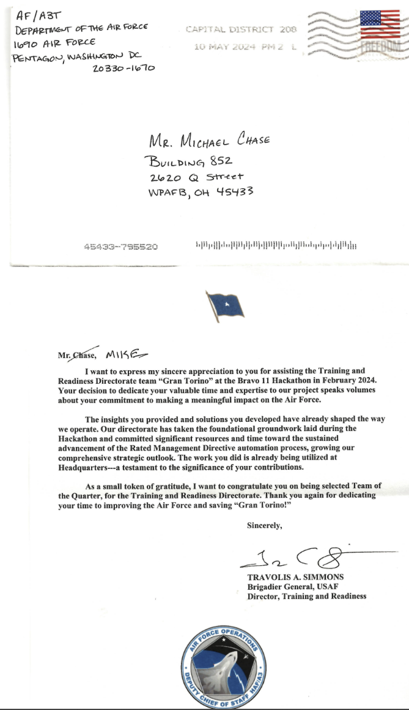

# Michael Chase Master Resume

A heavily annotated history so I can pick/choose experiences and condence them into a resume suited for the position I'm applying for.

## Work Experience

### Co-learning Branch

Unfortunately, most of the work falls under CUI or above, so I cannot discuss this experience publicly.&#x20;

* **Organization**: Air Force Research Laboratory; 711 HPW RHWOH, RHWOW, and RHWL before the re-organization.
* **Location**: WPAFB, OH
* **Dates**: January 2025-Present

Bullets:

* Contributed to AI Driven research focused on modeling human operator cognition and decision-making processes within complex simulated environments, specifically related to satellite operations.
  * The Oko project is my primary contribution though I cannot say publicly my contributions.
  * Essentially, there's a JS/Typescript/Vue backend.
* Several microservices are launched within Docker containers.&#x20;
* We made the decision to overrule OMC and make them get us Docker Engine & Docker Compose because they are free, but I was the guinea pig for Podman.
* Docker Desktop is licensed, that was a headache and they wouldn't install it on my Defense Educational Research Network (DREN) machine.
  * Administered COLANET resources specific to AI/ML. Worked with Michael D on installing dependencies for PyTorch in an offline environment and getting that setup for projects I can't name.
* Developed and refactored a JavaScript/Vue codebase, aiding in efforts to transition key systems to open-source solutions and improve overall systems architecture (e.g., migrating from Docker Desktop to Podman).

#### "Evaluating Of LLMs Ability to Make Scenario Based Training More Immersive And Improve Learning Outcomes"

* **Resume Bullet:** Initiated and prototyped a voice-interactive game using LLMs to generate dynamic NPC dialogue for a deception-based scenario (e.g., players lying to gain access); showcased this independent project and its technical framework in a successful poster presentation.
* Called it LLM Scenario Based Training Learning Outcomes

<figure><figcaption>
Proof can be found in  "AFRL Discover 2024 Poster List"
</figcaption></figure>

<figure><figcaption>
Poster is 031-Chase-EvaluatingOfLLMsAbilityToMakeScenarioBasedTrainingMoreImmersiveAndImproveLearningOutcomes
</figcaption></figure>

The presentation was generally well received. I was lauded for being able to communicate my work in a way everyone could understand versus other presentations which were highly complex and required specialized knowledge. Mine did too, but customers understood the problem, my approach, why it was unique, and why it was useful. I was given POCs of several interested customers before returning to my master's program.

### Gaming Research Integration for Learning Laboratory

<figure><figcaption></figcaption></figure>

* **Organization**: Air Force Research Laboratory; 711 HPW RHWL; Gaming Research Integration for Learning Laboratory.
* **Location**: Kettering, OH
* **Dates**: May 2020 - Jan 2025
* Resume Bullets
  * Created virtual reality environments using the Unreal Engine, C++, and Blueprints Visual Scripting.
  * Led and contributed to developing impactful educational and research tools, including a UE5 MPERPG for officer training, a VR watchstanding simulator with gaze-tracking, and a VR system for capturing human expert data (e.g., spray painting techniques) to train AI/robotic systems.&#x20;
  * Contributed to lab operational readiness by assisting with network administration, GitLab configurations, firewall adjustments, and resolving diverse IT support requests. \* Initiated, designed, and deployed a new lab website using Google Sites, significantly improving usability, content accessibility, and collaborative maintenance capabilities over the previous WordPress platform.
  * Delivered technical instruction and outreach presentations to students and stakeholders, promoting GRILL's capabilities and fostering engagement with ongoing research initiatives.&#x20;
  * Successfully transitioned from PCIP to PAQ status (May 2022) with an increase in responsibilities and leadership expectations.

#### Current Evolution of VR Input Modalities

Co-author "Current Evolution of VR Input Modalities" Rebensky et al.; presented at IT2EC 2023. See `FINAL_CurrentInputModalities.docx`. Should be published on I/ITSEC.

<figure><figcaption></figcaption></figure>

#### Team-Situational Awareness for Watchstanders

* **Timeline**: Summer 2024
* Aim was to create a 3D, VR maritime environment that enables instruction and investigation of various approaches and concepts such as alerting schemes, teaming arrangements, visualization capabilities, decision making aids, etc. Internal users may see`GRILL Challenge Problem Overview - 20240618` for more info.

#### Multi-Player Educational Role Playing Game (MPERPG)

* **Timeline**: Summer 2024


TODO: find PA approved materials for this section.


#### Bravo 11: Gran Torino

* **Location**: Schofield Barracks, Hawaii
* **Dates**: Feb 2024.


TODO: find PA approved materials for this section.


Received an award and thank you letter from a brigadier general.

<figure><figcaption></figcaption></figure>

Here's the team I worked with in Hawaii:

<figure><figcaption></figcaption></figure>

#### Bravo 10 Bravo Biometrics

* **Timeline**: 2022
* **Location**: Destin–Fort Walton, Florida.
* **Awards**: runner's up for best project via people's choice award.
* **Purpose**: address pilot readiness and fatigue to reduce pilot turnover (where training cost btw $12-20M per pilot)
* **Tools/Solution** a pilot dashboard built in Plotly consisting of physiological data (from loop smartwatch). It was a data-science application leveraging python's pandas, matplotlib, etc.

#### GRILL Website


TODO: describe how I singlehandedly just built the website because the old one sucked & I thought it would be easy to just make one. Tim didn't think I could, but I did it and it was so much better that we made it live.&#x20;


#### Pollution Damage

This was a simulation tracking pollution for NASIC because NASIC definitely cares about the environment... at the unclassified/PA approved level at least.

#### Streamliner

Another administrative application I bult in Python to track what students are doing and improve learning outcomes by providing mechanisms to gather information.&#x20;

#### Kendall Hat Testbed

* **Date**: 2023
* Stayed at Golden Nugget Casino; wrote a report on my travels and new technologies
* Presented to team about use cases & what to explore/purchase with other attendees.

#### VR Dimentia

TODO: review this project. My first real object-oriented UE4 project. Also helped with a SpaceX dragon capsule rescue mission this year.&#x20;

#### Miscellaneous Work

* **"Tech Behind the Takeoff Brief/Presentation: Apps Beyond code, image, and text generation"** was  a presentation/brief I gave to high-schoolers discussing how we organize files, how LLMs aid in research with PDF parsing & text abstraction, Google's DeepMind program searching, training at the GRILL, progressive upscaling, biology topics, design topics, IoT toolchains, operations, psychology applications (e.g. facial expression recognition), the potential for more insecure code w/ AI assistents/agents, robotics, security (e.g. jailbroken chatbots, techniques for jailbreaking, offensive cybersecurity, and ransomware attacks. Worked w/ Dr. Stef Fussell gave an avaiation presentation & C1C Luke Kuklis in these briefs.
* TKinter/Turtles: I built a Python using all standard/built-in libraries to teach K-12 kids python during COVID. Students solved codecademy-like challenges and I spoke for Southpointe Academy in Canada.
* Attended & was involved wth the Montgomery County Educational Service Center with Gretchen Capogna.&#x20;
* Single-handedly processed and provided 50 job shadows with experience making my Python Turtles drawing application.&#x20;
* Lots of student/STEM work, helping teachers, going to career fairs, setting up VR simualtions.&#x20;
* Evaluated JetBrains YouTrack for private, secured, government-approved private solutions to test productivity.&#x20;
* CES Las Vegas 2023 - we stayed at Golden Nugget and reported on new technologies we saw and wanted to purchase for our research projects.

### Student Stage Technician

* **Dates**: Oct. 2017 - Oct. 2019
* **Location**: University of Dayton | Dayton, OH
* Resume Bullets
  * Programmed an operated lights for various musicals, plays, and live events.
  * Aided in set construction, fly operation, and stage management for major productions.
  * Provided customer and personal service to clients.

### Dean's Summer Fellowship

* **Dates**: July 2019 - Aug. 2019
* **Location**: University of Dayton | Dayton, OH
* Resume-Worthy Bullets
  * Produced technical drawings according to USITT standards into Vectorworks
  * Dimensioned and modeled the PNC Arts Annex, a local theater.

### Assistant Stage Manager

* **Dates**: May 2019 - July 2019
* **Location**: London, UK
* Bullets
  * Applied critical thinking skills to provide new and innovative data analytics practices.
  * Setup DMX lighting fixtures and other technical aspects for Pictures of Dorian Gray.

### Blue Crew Counsellor

* **Dates**: July 2018 - Aug. 2018
* **Location**: University of Dayton | Dayton, OH
* Bullets
  * Introduced new students to the university through a leadership focused camp.
  * Aided in various logistical functions during the freshmen orientation experience.

### Summer Intern, Somewhere Recording LLC

* Aided in various logistical and technical funtions of the recording studio.
* Gained experience in Pro Tools and Logic Pro.

### Fitness Supervisor

* **Dates**: Aug. 2016 - Juy 2018
* **Location**: Brecksville, OH
* Provided customer service to members.
* Enforced gymnasium rules and policies

### Lab Intern

* **Location**: Chromascape Inc. | Twinsburg, OH
* Bullets
  * Developed formulas for color products that met all performance expectations.
  * Collaborated with other chemists to develop and perform tests for color and chemical products.

### NASA Student Shadow

* **Location**: Glenn Research Center | Cleveland, OH
* **Dates**: May 2017
* Shadowed and aided civil and electrical engineers in a 3-week experience at NASA.

## Skills

<figure><figcaption></figcaption></figure>

## Extracurricular Activities

#### Newer

* Piano Ensemble
* Piano Performance
* Caesar Creek Gliding Club. Flying, volunteer groundskeeping.

#### Older

<figure><figcaption></figcaption></figure>

## Education

### Undergraduate

TODO: get a transcript here or for my CV/Collections
