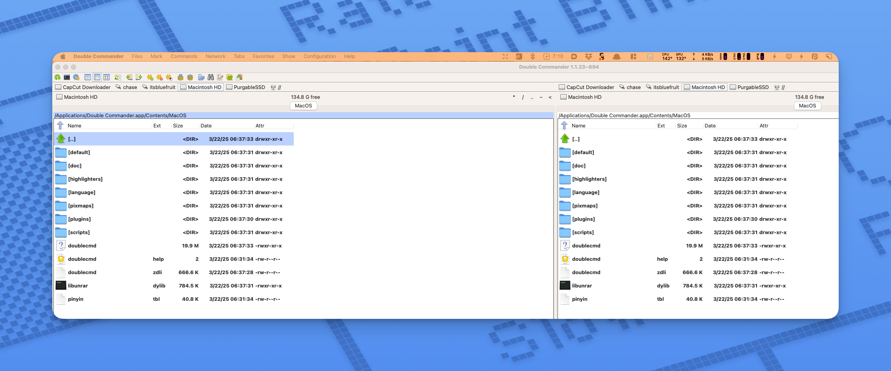
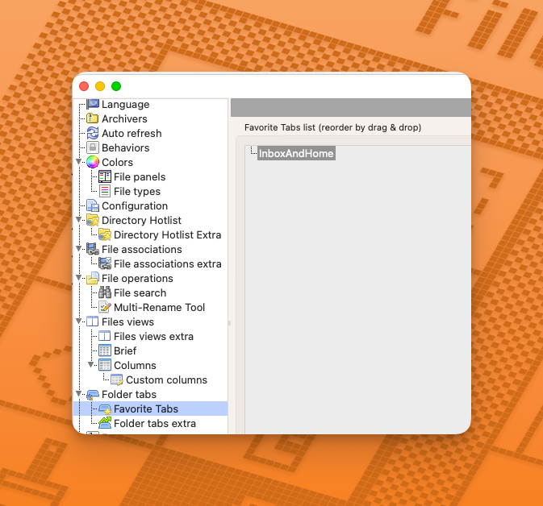
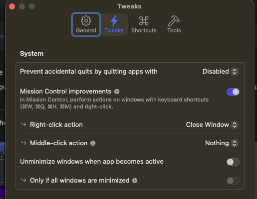

# Noteworthy Apps ToSort

For re-imaging Mac OS without the crud.

1. **VPN Connections**: home, work, and cloud servers.
2. **Network Drives**: Home NAS, Work NAS, Google Cloud NAS.
3. **Cloud Drives**: Dropbox.

## Open Source

### Double Commander

<figure><figcaption></figcaption></figure> <figure><figcaption></figcaption></figure>

* There are too many [shortcuts](https://doublecmd.github.io/doc/en/shortcuts.html) to list
* Configure tabs in settings.

<figure><figcaption></figcaption></figure>

## Setapps

### Bartender:

* start at login
* SHIFT+CMD+, assign hotkey for quick search menu bar items.
* Change to an `<` to remember the hotkey.
* Don't install on desktops or devices without the (poorly implemented) notch.

### Better Touch Tool

* TipTap Left Finger (of three): close window underneath cursor.
* TipTap Middle Finger (of three): fullscreen
* 4-Finger Force Click: take a screenshot. (Hit space for window!)

### Bolt

* **Hotkey**: CMD+Option+B
* Import OpenAi key in Settings -> Services

### Cleanshot

* Start at login
* Make export location somewhere reasonable.
* Disable quick access overlays.
* Copy flies to clipboard & save boxes should be checked.
* Open Annotate tool w/ screenshots & video editor.
* Shortcuts -> Set screen recording to `Shift+CMD+6`&#x20;
* Advanced -> Ask for name after every capture.

### Commander One

This is what Dual Commander took inspiration from, but it's a bit more stable I think.

* CMD+F7 -> Search
* CMD+Opt+F7 -> Search in Spotlight

<figure><figcaption></figcaption></figure> <figure><figcaption></figcaption></figure>

### Dash

* **Hotkey**: CMD+Option+D to show dash and focus search field.

### Dev Utils

* CTRL+Option+CMD+Space
* Don't have this autostart?

### Default Folder X

* **Hotkey**: CMD+SHIFT+SPACE
* Add menu to finder toolbars.

### Dropzone

Has lots of shortcuts, but you have to make them:

* **Hotkey**: F3
* ZIP Stuff
* Email AirDrop Shorten URL Zip Files Unzip Files Open
* Custom Open Terminls at Path
* Facetime Annie/Mom

### Elephas

* **Hotkeys**
  * CTRL+SHIFT+/: Floater Menu
  * `CTRL` + `/`: Super command.
  * LOTS OF OTHER HOTKEYS THAT MAY BREAK stuff Check/Remove.

### Paste

* **Hotkey**: CMD+SHIFT+V

### Supercharge

* **Description**: a tweaker tool for Modifying Mac OS functionality. Kind-of like a registry editor but for my OCD.&#x20;
* Do not mess with the screenshot tools. Use Cleanshot instead to configure the annotation tools after
* I'm self-experimenting with 'note' link and mission control _improvement_ where you can right click to close a window. I had mission control plus which was similar.&#x20;

Pics

### Text Sniper

* CMD+SHIFT+2 to capture the text.
