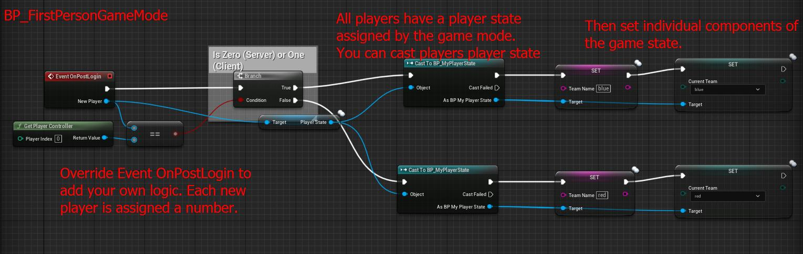

# Capture The Flag Debugging

Eventually I want to redo this and make it into a tutorial. Maybe I will today.

## Assigning Teams on Player State from GameMode

First, make an enum.

<figure><figcaption></figcaption></figure>

Second, assign teams.&#x20;

<figure><figcaption></figcaption></figure>

The Game Mode has a function `GetGameState()` which contains the `PlayerArray` of all player's `Player State` references in an array. Zero is the server, and if you add another one it gets `1` and `2` and so on. To add more, you can allegedly just set it to `-1` and UE will append it to the end of `PlayerArray`.&#x20;

## Debugging

<figure><figcaption></figcaption></figure>

### Context

I'm working on a networked Capture the Flag game in Unreal Engine 5. I was refactoring the code to use enums for team assignments instead of strings, but ran into some issues. I reverted to a previous commit where team assignment was partially implemented using strings, but I'm still encountering casting errors. I'd like to understand the cause of this error and how to fix it, as I believe it will help me learn more than simply reverting further back in Git.

### Issue Description

In the `BP_FirstPersonCharacter` Blueprint, I have a macro called `getPlayerState`. This macro aims to retrieve the player's state and cast it to our custom `BP_MyPlayerState` class. However, the cast consistently fails, resulting in a warning message: "Warning: BP\_FirstPersonCharacter getPlayerState Invalid."

<figure><figcaption></figcaption></figure>

It's successfully set in the game mode. The Hellos don't fire off.

<figure><figcaption></figcaption></figure>

### Steps to Reproduce

* Open the `BP_FirstPersonCharacter` Blueprint.
* Locate the `getPlayerState` macro.
* Observe the "Cast Failed" execution pin being triggered.
* Check the Output Log for the warning message mentioned above.

<figure><figcaption></figcaption></figure>

### Expected Behavior&#x20;

The `getPlayerState` macro should successfully cast the `PlayerState` reference to `BP_MyPlayerState` and output the casted reference.

### Current Implementation Details

* **GameMode (BP\_FirstPersonGameMode):**
  * Overrides `OnPostLogin` to assign team names ("blue" or "red") based on player ID.
  * Sets the `PlayerState` class to `BP_MyPlayerState`.
* **Player State (BP\_MyPlayerState):**
  * Contains a `TeamName` variable (currently a string, was previously an enum).
  * `TeamName` is initialized to "null" in the construction script.
* **First Person Character (BP\_FirstPersonCharacter):**
  * Construction script sets some variables and calls the `getPlayerState` macro.
  * The macro attempts to get the `PlayerState` reference, cast it to `BP_MyPlayerState`, and store the result.

### Additional Notes

* The `TeamName` variable in `BP_MyPlayerState` is currently set to "blue" in the `BP_FirstPersonCharacter` construction script, even though team assignment is handled in the GameMode. This is probably redundant.

### Possible Causes (Gippity)

* **Timing Issue:** The `getPlayerState` macro might be called too early in the character's lifecycle, before the `PlayerState` has been properly initialized by the GameMode.
* **Casting Error:** There might be an issue with the casting process itself. Perhaps the `PlayerState` object is not of the expected type (`BP_MyPlayerState`) at the time of the cast.
* **Blueprint Compilation:** A stale Blueprint compilation could be causing unexpected behavior.

Troubleshooting Steps:

* **Delay the Cast:** Try adding a slight delay before calling the `getPlayerState` macro, to ensure the `PlayerState` is fully initialized.
  * Didn't work; can't add delay nodes in construction scripts.
* **Print Player State Class:** Add a print statement (or log message) to display the actual class of the `PlayerState` object before attempting the cast. This will help verify if it's the correct type.
  * Tried this, but output was empty & didn't show the type.
  * I got excited that the warning went away, but I didn't have anything after the print string.&#x20;

<figure><figcaption></figcaption></figure>

#### Also - why didn't this print anything if it's not assigned. What's isValid() doing?

<figure><figcaption></figcaption></figure>

Turns out I put the `Debug.BP_FPC Invalid` error within my `GetPlayerState` macro.&#x20;

## Debug Solution

First, we **removed the construction script pin** and deleted the macro moving the logic there.

<figure><figcaption></figcaption></figure>

We set the team inside an event (within  `BP_FirstPersonCharacter` )

<figure><figcaption></figcaption></figure>

To debug & get the name, we pulled off of `Event Possessed` now because it wasn't possessed by the client previously.

<figure><figcaption></figcaption></figure>

And I learned about a few new functions within the Game Mode

<figure><figcaption></figcaption></figure>

## Initial Design

<figure><figcaption></figcaption></figure>

## Output Log Tags

You can perform output log tagging by appending `Warning` or `Error` to a print string.

