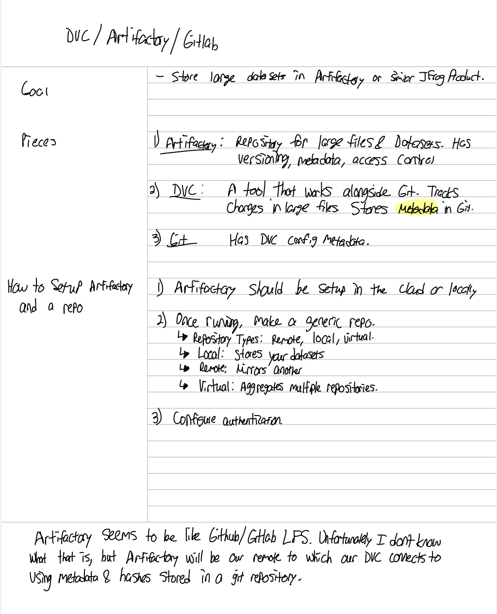
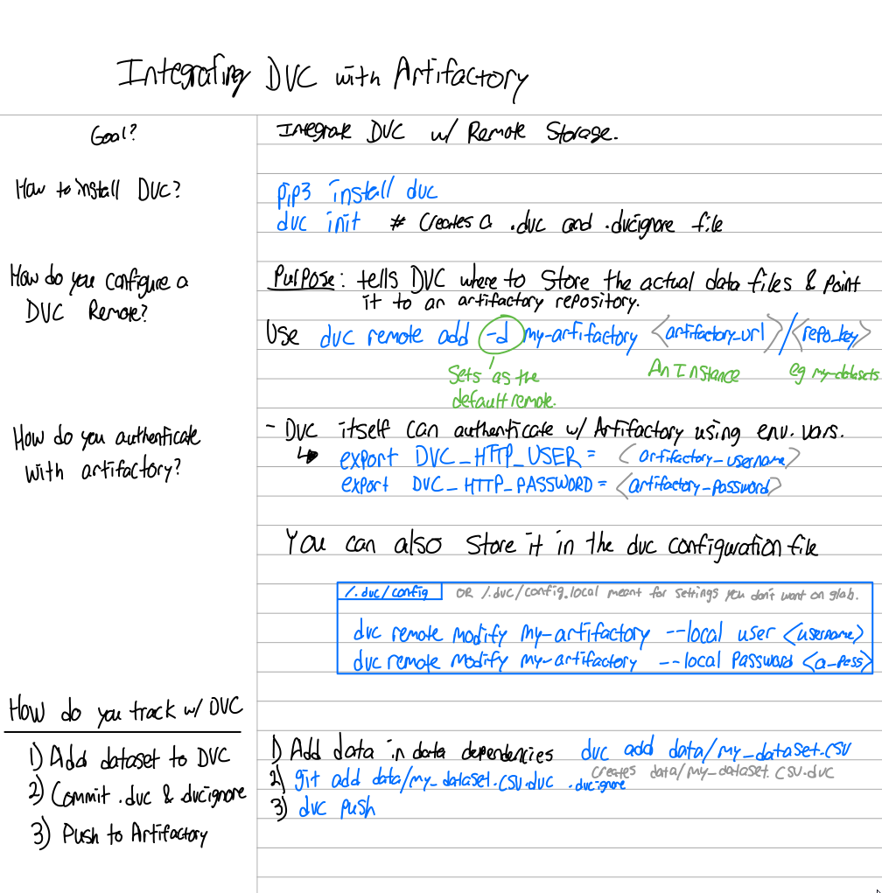

# DVC
- [Video](https://www.youtube.com/watch?v=kLKBcPonMYw)

DVC is like LFS but often used for data sets.

## DVC+Artifactory+Gitlab

## Reproducing Data
1. Clone the repo with `git clone <repo>`
2. Run `dvc pull` to get the data