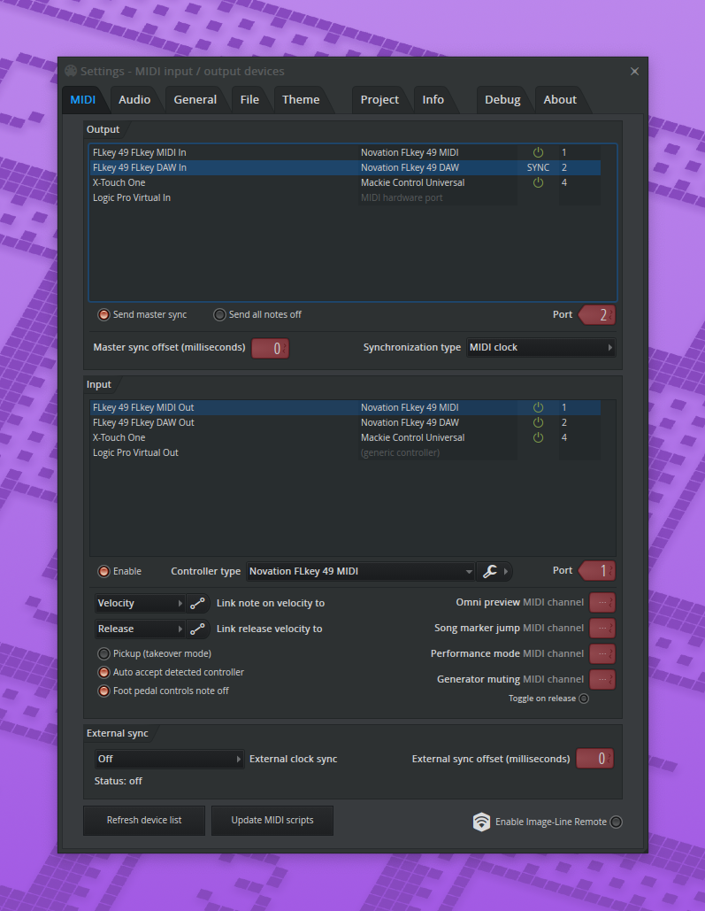

# FL Studio Docs

## Configuration 2025MAY

* For a FLKey49, Xtouch Univerial Control Surface
* Make sure inputs are enabled & ports are configured like so:

<figure><figcaption></figcaption></figure>

## Docs

* ["How to use FL - making music"](https://www.image-line.com/fl-studio-learning/fl-studio-online-manual/html/basics_workflow.htm) is an html manual from their site.&#x20;
* And more...
  * [What's New?](https://www.image-line.com/fl-studio-learning/fl-studio-online-manual/html/basics_new.htm) - See a list of the key new features in this edition of FL Studio.
  * [The user interface](https://www.image-line.com/fl-studio-learning/fl-studio-online-manual/html/basics_interface.htm) - The main windows and how to use the User Interface (UI).
  * [Video tutorials](https://www.image-line.com/fl-studio-learning/fl-studio-online-manual/html/basics_videos.htm) - A summary of the YouTube video tutorials.
  * [Making music](https://www.image-line.com/fl-studio-learning/fl-studio-online-manual/html/basics_workflow.htm) - Explains how everything comes together to make a complete song.
  * [Hardware controllers](https://www.image-line.com/fl-studio-learning/fl-studio-online-manual/html/basics_controllers.htm) - Covers some hardware options that will make your FL Studio experience better.
  * [Keyboard & Mouse shortcuts](https://www.image-line.com/fl-studio-learning/fl-studio-online-manual/html/basics_shortcuts.htm) - A list of the most useful keyboard shortcuts.
  * [Useful web-links](https://www.image-line.com/fl-studio-learning/fl-studio-online-manual/html/basics_web.htm) - Some of our favorite websites, naturally starting with our own.
