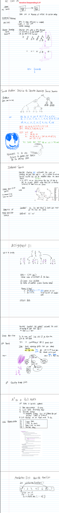

# AI

Most of my knowledge comes from:

1. CPS 5?? AI Spring 2024 @ UD by Ju Shen
   * Contact: 229-2195; jshen1@ud; JH 118
   * TA: Namartha Thata
   * Book is AI: A Modern Approach by Russel/Norvig
   * Academic Papers from: AAAI & CVPR
2. Crash Course AI (With Hands-On Labs!)
3. 3Blue1Brown Videos

## Projects

TODO: put github/gitlab project links here...

## General Information

* **Programming** is static code while **AI** is generative, dynamic, and responds to new environments.
* Conceptualized in 1956, but hardware limitations & a lack of data sources hindered progress until 2012.

## Class Notes

<figure><figcaption></figcaption></figure>

<figure><figcaption></figcaption></figure>

<figure><figcaption></figcaption></figure>

