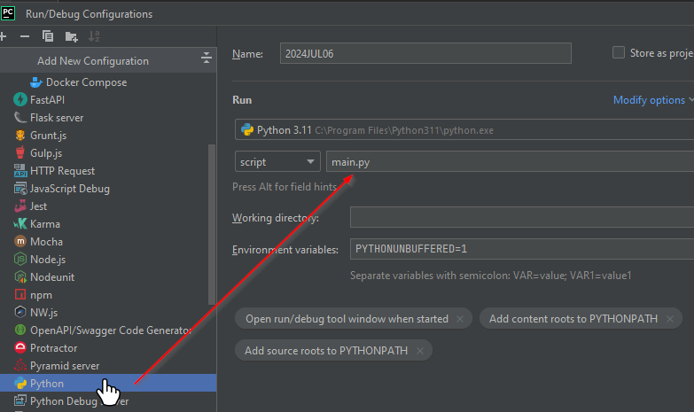
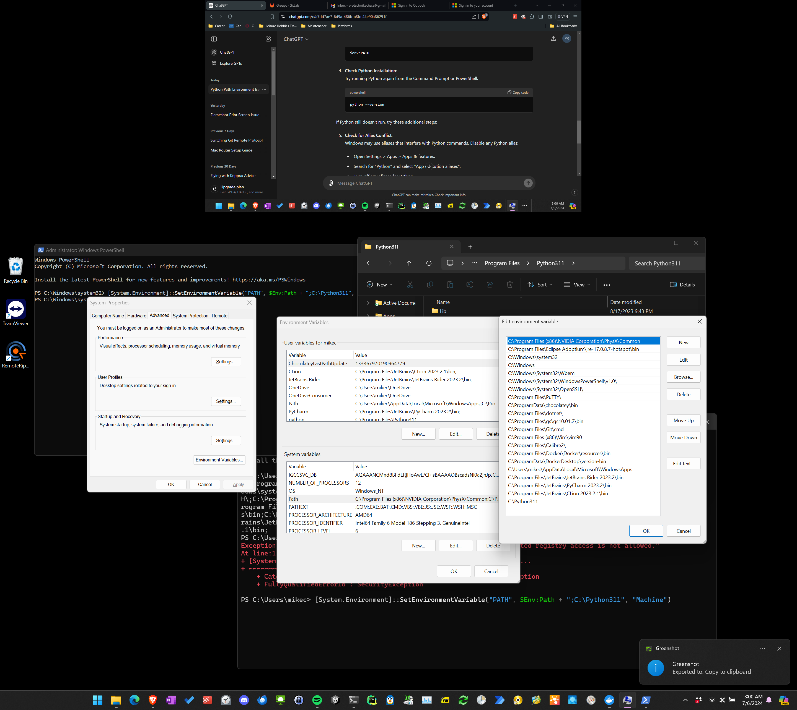

# How to Setup DAM-IT!
Here's going to be a long tutorial for however the heck to do this.
There's a lot of steps. I'm nervous. But it starts with starting.
I've got a few friends who can help if I need it.

# 01 Setting up Project Repository
I'll regret this later perhaps, but let's start with a blank app even though
I plan to switch to the Django and Docker configs later.

I'm not a Windows guy. But anyways, make sure you double click the \$PATH variable because
I just speent 40 minutes figuring out why it wasn't in PATH when I was adding it to sys variables.
Also helps to not use Chat Gippity for the locatoin but find it manually & add the folder to $PATH

