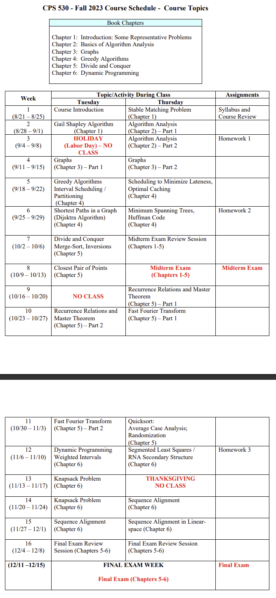
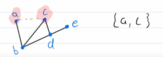

# CPS 530 Syllabus

## Design Considerations

* **Proof of Correctness**: using mathematical induction, contradiction, loop invariants
* **Theory:** complexity classes, lower bounds, reduction
* **Practice**: overcome intractability via approximation & improve performance through randomization.

## Representative Problems

There are five problems that are variations of the independent-set problem. One is solvable by a greedy algorithm, another by dynamic, one by network flow, the independent set problem itself (which is NP complete), and one is PSPACE-complete.

### On Independent Sets

[Article](https://www.meltingpointathens.com/what-is-the-maximum-independent-set-problem/)

* **Independent Sets** problems are where we must find the largest set of verticies such that no two are ajacent.
* The problem is NP-complete (very hard) and there's no known efficient algorithm.
* There's a number of approximation algorithms that can find good solutions in polynomial time.
* In this section, we talk about the **applications**: like scheduling, resource allocation, and network design.

#### Independent Set Example

* Given a graph `G=(V, E)` find the largest independent set in `G`.
  * Where G is the entire graph.
  * V is a set of vertices
  * E is the set of edges.

* For example, here the set `{a, c}` is an independent set
* **Maximal** independent sets mean there are no vertexes we can add to the graph while preserving independence.
  * Example: `{a, c, e}` is a maximal
  * Non-Example: `{a, b}` are not an independent set because it's connected.
  * `{b}` is a trivial independent set.

<figure><figcaption></figcaption></figure>

### Other Representative Problems

* [Interval scheduling](../../../computer-science/data-structures-and-algorithms/computer-science/data-structures-and-algorithms/greedy-algorithms/interval-scheduling.md)
* Weighted Interval Scheduling
* Bipartite Matching
* Independent Set (NP Complete, Describe above)
* Competitive Facility Location (PSCPACE-Complete, no notes yet)
