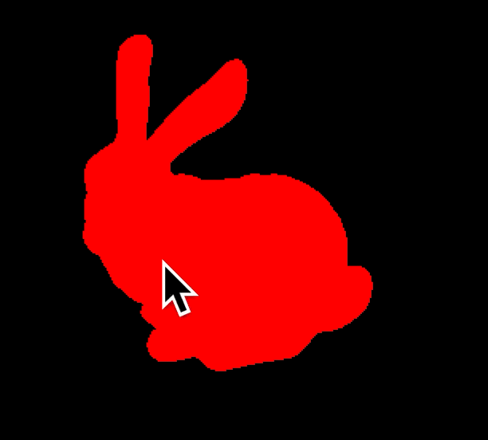

# OpenGL Bunny Transformations







## OpenGL Bunny Transformations

This project was initially intended to be implemented in C++, but due to complications with OpenCV and OpenGL installations, it was decided to use Python instead. Python's virtual environments provide a more manageable solution. For those interested in the C++ attempt, refer to the OpenGL Setup where OpenGL setup for Mac is discussed.

## Approach

The approach to this project is divided into several steps:

1. **Data Import**: The data from an .obj file is imported. The file is in plain text, so the String.split() and .startswith() methods, which are part of Python strings, are used for parsing. This process is encapsulated in a Data class.
2. **3D Object Display:** The 3D object is displayed using an OpenGL Python wrapper. The glColor3f() function is used to set colors, and glBegin() and glEnd() denote the beginnings and ends of glVertex()s to be shaded. A keyboard callback function is also implemented to toggle between solid and mesh views.
3. **Translation/Rotation Methods**: These methods are built without using OpenGL provided commands. Instead, OpenCV's Mat class is used to create matrices and homogeneous coordinates. These matrices are then multiplied to translate/rotate, and the display is updated using gluePostRedisplay() after mouse/keyboard actions.

### Parsing An `.obj` File to Extract Vertexes & Faces

After some deliberation I decided to wrap everything into a class like this:

```python

class Data:
    """
    Provides a way to interface to represent vertex data.
    Can be used by other libraries easily so i can use it between OpenCV/GL/NumPy if necessary.
    """
    def __init__(self, filename=None):
        self.vertices = []
        self.faces = []
        if filename:
            # Read the file
            with open(filename, 'r') as f:
              // Adds stuff to files.

    def __repr__(self):
        s = []
        // Adds stuff to that `s` list and prints it out.

    def __iter__(self):
        return iter(self.vertices + self.faces)

    # Getters/Adders for our data.
    # It's also an interactive interface for debugging.
    def add_vertex(self, vertex):
        if len(vertex) != 3:
            raise ValueError("A vertex must have three coordinates.")
        self.vertices.append(vertex)

    def add_face(self, face):
        if len(face) != 3:
            raise ValueError("A face must have three indices.")
        self.faces.append(face)

    def interactive_add_vertex(self):
        # An Interactive version...

    def interactive_add_face(self):
        face = input("Enter the indices for the face, separated by spaces: ").split()
        try:
            face = [int(x) for x in face]
            if len(face) != 3:
                raise ValueError("A face must have three indices.")
            self.add_face(face)
        except ValueError as e:
            print(f"Invalid input: {e}")
```

I considered using NumPy arrays, but since OpenCV is really a matrix calculator & Dr. Shen mentioned that I'm going to try & do my tranlsations/rotations with that. If I multiply by a 4x4 matrix, I can rotate 3D objects. I'll dive more into the math later.

### Displaying Vertexes and Faces with OpenGL

Next up, I'm going to create a class to encalsulate the bunny's vertexes and faces. I asked a large language model how to keep myself organized since I've never designed such a task before and it told me I should:

1. Create a bunny class
2. Use composition
3. Define rendering methodsd
4. Implement transformation methods
5. Add interaction methods
6. Provided initialization.

Therefore, I created a `Bunny` class in my script and wrote a `def __init__()` method which covers the first and last element.

I forgot what composition so I asked the LLM if that meant the same as inheritance. I'm not sure what I'd want to inherit from, but it turns out that a composition holds an instance of another class & deligates some behaviors back to the existing class. Therefore, it's not really inheritance but really just accessing public elements/methods in another class. In Python, there's no such things as public/private stuff that I know of in the builtins, so this is probably a sloppy way of doing things. The LLM says it's loosly coupled and a good practice so let's go with that and maybe I'll see why it's nice as I keep implementing it this way.

```python
class Bunny:
    def __init__(self, filename: str):
        self.data = Data(filename)

    def render(self):
        # Implement rendering logic using OpenGL
        pass

    def translate(self, x: float, y: float, z: float):
        # Implement translation logic
        pass

    def rotate(self, angle: float, axis: List[float]):
        # Implement rotation logic
        pass

    def scale(self, factor: float):
        # Implement scaling logic
        pass

    def handle_interaction(self):
        # Implement interaction handling logic
        pass
```

### Rotating with Quaternions & Translations



Combine with this

## OpenGL Bunny Transformations

This project was initially intended to be implemented in C++, but due to complications with OpenCV and OpenGL installations, it was decided to use Python instead. Python's virtual environments provide a more manageable solution. For those interested in the C++ attempt, refer to the [OpenGL Setup](opengl-setup.md) where OpenGL setup for Mac is discussed.

### Approach

The approach to this project is divided into several steps:

1. **Data Import**: The data from an `.obj` file is imported. The file is in plain text, so the `String.split()` and `.startswith()` methods, which are part of Python strings, are used for parsing. This process is encapsulated in a Data class.
2. **3D Object Display**: The 3D object is displayed using an OpenGL Python wrapper. The `glColor3f()` function is used to set colors, and `glBegin()` and `glEnd()` denote the beginnings and ends of `glVertex()`s to be shaded. A keyboard callback function is also implemented to toggle between solid and mesh views.
3. **Translation/Rotation Methods**: These methods are built without using OpenGL provided commands. Instead, OpenCV's `Mat` class is used to create matrices and homogeneous coordinates. These matrices are then multiplied to translate/rotate, and the display is updated using `gluePostRedisplay()` after mouse/keyboard actions.

The progress so far is as follows:

* [x] Import data from file.
* [x] Display the bunny object on screen.
* [x] Implement the ability to switch between solid & mesh views.
* [ ] Use OpenCV for matrix operations. (Requirement removed; doesn't work)
* [ ] Accurately translate/rotate the bunny object.
* [ ] Integrate basic settings for display size & perspective projection.
* [ ] Control mouse movement speed by appropriately scaling pixel changes to the rotation/translation in 3D space.

### Parsing An `.obj` File to Extract Vertices & Faces

The decision was made to encapsulate the parsing process into a class, `Data`. This class provides an interface to represent vertex data and can be used by other libraries such as OpenCV, GL, and NumPy if necessary.

The `Data` class includes methods for adding vertices and faces, both interactively and non-interactively cause I thought that'd be useful even though I've barely used it. It also includes a `__repr__` method for a string representation of the object, and a `__iter__` method to make the object iterable. Got Copilot to write the Unit Tests.

### Displaying Vertices and Faces with OpenGL

A `Bunny` class was created to encapsulate the bunny's vertices and faces. This class uses composition to hold an instance of the `Data` class and delegates some behaviors back to it. The `Bunny` class includes methods for rendering, translating, rotating, scaling, and handling interactions.

#### Rotating with Quaternions & Translations

For more information on rotating with quaternions and translations, refer to this [resource](https://eater.net/quaternions).

#### Naive Approaches

## Implementing Keyboard Callbacks

GLUT I believe is the one that handles the window. You can make your own function and register it like so

```
import keyboard

def on_keyboard_callback(event):
    if event.name == 'q':  # Replace 'q' with the key you want to listen for
        print('You pressed the specified key!')
        # Add your custom logic here

# Register the callback
keyboard.on_press(on_keyboard_callback)

# Keep the program running (you can add other logic here)
while True:
    pass
    
```


Next thing I solved was ability to fill in the bunny textures which certainly did something. 

## Mouse Functionality

### glutGetModifiers() Call Positioning & Debugging

I spent a few hours debugging an issue with this callback. I originally wrote `glutGetModifiers = glutGetModifiers()` which returned an int. I thought it'd be okay to compare this to the constant for shift which is defined as 1 in the OpenGL. My error-prone code is below if you'd like to have a gander.&#x20;

```python
def handle_mouse_motion(self, x, y):
    '''
    This function will be called whenever the mouse moves within the window while one or more mouse buttons are pressed.
    :return: None
    '''
    print(f"Before glutGetModifiers in handle_mouse_motion: {time.time()}")
    # GLUT Warning: glutCurrentModifiers: do not call outside core input callback.
    # modifiers = glutGetModifiers(). # BIG ISSUES!!
    print(f"After glutGetModifiers in handle_mouse_motion: {time.time()}")
    # rest of your code...
    if glutGetModifiers == GLUT_ACTIVE_SHIFT:
        self.inTranslateMode = True
        print("ACTIVATE Translate Mode"). # Never gets called at this point.
    else:
        self.inTranslateMode = False
        print("Deactivated Translate Mode")

    if self.inTranslateMode:
        # Apply translation based on mouse movement (scaled down by 100x)
        self.apply_translation(x / 10.0, y / 10.0, 0)
        glutPostRedisplay()
```

<details>

<summary>Original Error (Even more Error Prone Code)</summary>

You see a problem here? Let me know...

```
def handle_mouse_motion(self, x, y):
    '''
    This function will be called whenever the mouse moves within the window while one or more mouse buttons are pressed.
    :return:
    '''
    print(f"Before glutGetModifiers in handle_mouse_motion: {time.time()}")
    modifiers = glutGetModifiers()
    print(f"After glutGetModifiers in handle_mouse_motion: {time.time()}")
    # rest of your code...
    if modifiers == GLUT_ACTIVE_SHIFT:
        self.inTranslateMode = True
        # print("ACTIVATE Translate Mode")
    else:
        self.inTranslateMode = False
        # print("Deactivated Translate Mode")

    if self.inTranslateMode:
        # Apply translation based on mouse movement (scaled down by 100x)
        self.apply_translation(x / 10.0, y / 10.0, 0)
        glutPostRedisplay()
        
```

I asked the Ghat Gippity what I did & it gave me some bullcrap about my constructor:

Specifically, you used it in the `Bunny` class constructor to check for modifier keys. However, using `glutGetModifiers()` outside of the registered callback functions is not recommended because it relies on the OpenGL state, which might not be properly initialized at that point in the code execution.\


Clearly, I didn't call it. No idea why this fix worked.

<pre><code><strong>class Bunny:
</strong>    def __init__(self, filename: str):
        self.data = Data(filename)
        self.inMeshVersion: bool = False
        self.inArbitraryLineMode: bool = False
        self.inTranslateMode: bool = False
</code></pre>


</details>

### Fixing Active Shift Modifiers

An important part of debugging is learning what went wrong & learning from it. If I ever run into the problem again, it's documented in this notebook! Anyways, while debugging I noticed that hitting shift never changes my bool

While debugging, I noticed that it's never activated when I hit shift and move the mouse. An important part of programming is figuring out what actually is going wrong&#x20;

<figure><figcaption></figcaption></figure>

It is generally bad practice to be changing the same global variables in callbacks... especially since python now supports multithreading soon. As of April 2024, there was a GIL (global interperter lock) that prevented the same interperter from running things concurrently despite there being a threading library. I think you could disable the GIL if you were using that library but it wasn't encouraged by devs for some reason and instead they told me to go learn C, C++, and`Go.`&#x20;

Looks like I just missed a function call (aka no parenthesis at the end):

<figure><figcaption></figcaption></figure>

And oh nnooooooooo it turns out I didn't fix the last bug after all:

<figure><figcaption></figcaption></figure>

#### Refactoring to Split Handling Shift Into Multiple Functions

The great oracle of chat gippity told me to refactor my crap code so I did. Wouldn't you? The more I do this, the better of a coder I become; however, I look incredibly suspicious when turning this for an assignment. Did anyone write code this good 10 years ago just to get things working? Probably senior devs who know better. Anyways, made these changes.&#x20;

<figure><figcaption></figcaption></figure>

I don't like their suggestion because of how it's all coupled together, but whatever. Once I typed it in I realized that I had to register more callback functions within main which I thought would be inefficient but with few lines of code and no loops it runs smoothly.&#x20;

After making these changes, more stuff broke and I forget what I even fixed now but here's one nice refactoring:

```python
   def render(self):
        if self.inMeshVersion:
            glBegin(GL_LINE_LOOP)
        else:
            glBegin(GL_TRIANGLES)

        for face in self.data.iterFaces():
            for i in face:
                # Subtract one apparently because obj indices start at 1.
                vertex = self.data.vertices[i - 1]
                glColor3f(1.0, 0.0, 0.0)
                glVertex3f(vertex[0], vertex[1], vertex[2])

        glEnd()
```

<figure><figcaption></figcaption></figure>

### Toggling with Space Instead

Having wasted time on stuff that's not related to the matrix and drawings, I implemented the rest like this and moved on.&#x20;

> ```python
> if key == b'\x20':  # ASCII value for space bar
>     # Reset the translation
>     if self.rotationMode == False:
>         self.rotationMode = True
>     elif self.rotationMode == True:
>         self.rotationMode = False
> ```

## Translating

About thirty hours later and three days overdue now, it'll translate. Not correctly though even though I think this translation matrix is setup right:

<div>

<figure><figcaption></figcaption></figure>

 

<figure><figcaption></figcaption></figure>

</div>

### Debugging GL Variables

Finally. Let's just open the debugger... and at long last, I just need to understand linear algebra and boom I'll be done with this mess! Let's look through the variables:

<figure><figcaption></figcaption></figure>

I thought that was a wonderful peek under the hood at what this library is keeping track of. I find it fascinating how they've named everything with a constant including draw\_buffers and error bits. It makes me feel like I could potentially be dealing with some low level system code & things that almost look like GPU registers.

### Linear Algebra Bits

Before reading this code, go back to the [quaternions](opengl-bunny-transformations.md#rotating-with-quaternions-and-translations) section and mess with the interactive videos linked there. We'll extend stuff into 4D and apply a translation that way because it's not possible with only a 3x3 array for reasons I don't quite remember.&#x20;

```python
def create_translation_matrix(self, x: float, y: float, z: float) -> np.array:
    """Creates a 4x4 translation matrix"""
    return np.array([
        [1, 0, 0, x],
        [0, 1, 0, y],
        [0, 0, 1, z],
        [0, 0, 0, 1]
    ])

def apply_translation(self, x: float, y: float, z: float):
    """Apply a translation matrix to all vertices."""
    # Create a translation matrix
    translation_matrix = self.create_translation_matrix(x, y, z)

    # Apply the translation matrix to all vertices
    for i in range(len(self.data.vertices)):
        vertex_4d = np.append(self.data.vertices[i], 1)  # 3D vertex => 4d by appending 1.
        translated_vertex = np.dot(translation_matrix, vertex_4d)  # Dot w/ translation matrix.
        self.data.vertices[i] = translated_vertex[:3]  # Update the vertex in-place

    # Calculate and print the new centroid
    new_centroid = self.calculate_centroid()
    print(f"New centroid: {new_centroid}")
```

**1. Homogeneous coordinates:**

* The code converts each 3D vertex (x, y, z) into a 4D homogeneous coordinate by appending a 1 at the end. This creates a vector in the form (x, y, z, 1).
* This is a mathematical trick that allows us to represent translations using matrix multiplication.

**2. Translation matrix:**

* The `translation_matrix` is a 4x4 matrix that encodes the translation amount along each axis. In 3D space, it typically looks like this:

```
[[1, 0, 0, tx],
 [0, 1, 0, ty],
 [0, 0, 1, tz],
 [0, 0, 0, 1]]
```

* `tx`, `ty`, and `tz` represent the translation distances along the x, y, and z axes, respectively.

**3. Matrix multiplication:**

* The code performs matrix multiplication between the `translation_matrix` and the 4D homogeneous coordinate vector (`vertex_4d`).
* This multiplication combines the scaling and translation factors defined in the matrix with the original vertex coordinates.

**4. Resulting transformation:**

* The resulting product (`translated_vertex`) is another 4D homogeneous coordinate vector representing the translated vertex.
* To retrieve the actual translated position in 3D space, the code extracts the first three elements (x, y, z) from the resulting vector and updates the original vertex data.

In essence, this code efficiently applies a translation defined by the matrix to all the vertices in the data set. This could be used to move objects in 3D computer graphics, animation, or other geometric processing applications.

### Graphing

I graphed some points in an attempt to do this by hand.

```
import numpy as np
import matplotlib.pyplot as plt

# Define a simple function to create a 3D object (replace with your bunny data)
def create_bunny():
  bunny_vertices = np.array([
      [0, 0, 1],
      [1, 0, 1],
      [1, 1, 1],
      [0, 1, 1],
      [0, 0, 0],
      [1, 0, 0],
      [1, 1, 0],
      [0, 1, 0],
  ])
  return bunny_vertices
```


<figure><figcaption></figcaption></figure>


Then after some work I got my bunny to translate wrong again, but I think I know what's wrong. It's my viewing/camera angle!

<figure><figcaption></figcaption></figure>

The issue with the program was not related to the viewing angle, but rather the lack of implementation for mouseUP/Down. This caused the program to always refer to the last clicked position, without accounting for new clicks or mouse movement without clicking. I also had to invert the y-axis because of how the coordinate system is referenced in OpenGL.

<figure><figcaption></figcaption></figure>

Next up is rotation!


