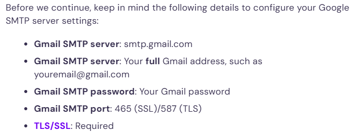

# On Settings.Py

.

PDF located in `"000-025 Educational Years\024 ITAndGradSchool\Career\Entrepreneurship DAM-IT\DjanoNotes 2024AUG26.pdf"`

<figure><figcaption></figcaption></figure>

<figure><figcaption></figcaption></figure>

<figure><figcaption></figcaption></figure>

To read/write about:

#### 3. The `django-admin` Utility and Settings

You're correct that the `django-admin` utility's behavior is influenced by the settings, particularly because it needs to know about the project's configuration to operate correctly. For example:

* **Database configuration:** `django-admin` commands like `migrate`, `makemigrations`, and `dbshell` require knowledge of the database settings. If these settings aren't configured correctly, these commands will fail.
* **INSTALLED\_APPS:** Commands like `migrate` and `startapp` rely on knowing which apps are installed. The settings define the apps included in the project, so the `django-admin` utility needs to access this list.
* **Logging and debugging:** Commands that involve server operations or tests might behave differently based on whether debugging is enabled or not, which is defined in the settings.

If the settings file is misconfigured or missing necessary parameters, the `django-admin` utility could fail or behave unexpectedly. This highlights the importance of having well-defined settings, especially for development vs. production environments.

#### 4. On the Server (`mod_wsgi`)

With `mod_wsgi`, you're running Django within an Apache server environment. The settings file is crucial here as it specifies how Django should interact with the web server and other services. You are right; configurations in `mod_wsgi` would include:

* **Setting the `DJANGO_SETTINGS_MODULE`:** This tells `mod_wsgi` which Django settings file to use (e.g., `myproject.settings.production`). This is typically done in the Apache configuration file.
* **Handling static files and media files:** The settings will define where static and media files are served from, which `mod_wsgi` needs to handle appropriately.
* **Security settings:** Configuration for allowed hosts, HTTPS, and other security measures are defined in settings and must be set up correctly for production servers.

#### 5. How Django Finds the Settings File

Django uses the `DJANGO_SETTINGS_MODULE` environment variable to locate the settings file. If this variable isn't set, Django will default to looking for `settings.py` in the directory where `manage.py` is located. This ensures that, in a typical project setup, Django can always find a settings file to use.

*   To set `DJANGO_SETTINGS_MODULE`, you typically define it in your environment:

    ```bash
    bashCopy codeexport DJANGO_SETTINGS_MODULE=myproject.settings.production
    ```
* In production, you might set this in the web server configuration, such as in an Apache or Nginx config file when using `mod_wsgi`.

#### 6. Seeing Which Settings Have Changed

To see which settings have been altered from their default values, Django provides a utility method. You can use the following command to see the changes:

```python
pythonCopy codefrom django.conf import settings
settings._wrapped.__dict__
```

This command allows you to inspect the current settings being used, showing only those that have been explicitly defined or changed.

#### 7. Using Settings in Python Code and Altering Them

Accessing settings within your Django application is done via the `django.conf.settings` module. You can access a setting like this:

```python
pythonCopy codefrom django.conf import settings

print(settings.DEBUG)
```

As for altering settings at runtime, while you can technically do it, it's generally not recommended for a few reasons:

* **Stability:** Changing settings at runtime can make debugging difficult and lead to unpredictable behavior.
* **Security and Best Practices:** Settings like database connections and secret keys should be static to prevent security vulnerabilities.

However, in some scenarios, altering settings at runtime is necessary. For instance, switching databases if one fails, as you suggested, or toggling between services. To alter settings dynamically, you can modify them directly:

```python
pythonCopy codefrom django.conf import settings
from django.db import connections

# Example: Switching database connections dynamically
if some_condition:
    settings.DATABASES['default'] = settings.DATABASES['backup']
    connections['default'].close()  # Ensure the old connection is closed
```

Another use case could be dynamically altering logging levels or enabling/disabling certain features based on the environment or a specific user’s preferences.

#### 8. More Examples of Dynamic Settings Changes

* **Feature toggles:** Enabling or disabling features dynamically based on user roles or specific conditions. You could have a setting that defines which features are active and change it based on user interactions.
* **Dynamic API endpoints:** Switching between different API endpoints for services, for example, using different versions of an API depending on user input or conditions.
* **Load balancing:** Adjusting settings related to server load balancing, such as timeouts or retry limits, based on real-time performance metrics.

#### 9. Accessing Environment Variables in Django

For security-sensitive settings, like secret keys or database passwords, it's a best practice to store them in environment variables and access them in your settings file using the `os` module:

```python
pythonCopy codeimport os

SECRET_KEY = os.getenv('DJANGO_SECRET_KEY', 'default_fallback_key')
```

*   **Command to get environment variables in Python:**

    ```python
    pythonCopy codeimport os
    secret_key = os.getenv('DJANGO_SECRET_KEY')
    ```


## More Questions to Enhance my Learning

10. Available settings:

What are some of the default settings provided by Django, and what do they control? How do you find out what settings are available to configure in Django?&#x20;


11\. Creating your own settings:

Why might you want to create custom settings in a Django project? How would you go about defining a custom setting, and how would you access it in your code? Using settings without setting DJANGO\_SETTINGS\_MODULE&#x20;


12\. What challenges might arise if you try to use settings without setting DJANGO\_SETTINGS\_MODULE?

How can you configure settings in situations where DJANGO\_SETTINGS\_MODULE isn’t set, such as in standalone scripts?&#x20;


13\. Custom default settings:

What might be a reason to use custom default settings? How would you implement a system that allows for custom default settings while still letting users override them? Either configure() or DJANGO\_SETTINGS\_MODULE is required&#x20;


14\. Why is it important for either configure() or DJANGO\_SETTINGS\_MODULE to be set before you use Django?

What could go wrong if neither of these is set properly? Calling django.setup() is required for “standalone” Django usage&#x20;


15\. What is the purpose of calling django.setup() in a standalone script?

How does calling django.setup() affect the usage of settings and models in non-Django-managed scripts?
