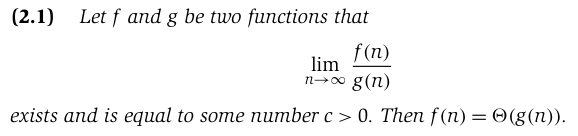

# Kleinberg Basics of Algorithm Analysis
* **Purpose**: understand general notion of efficiency running time.

## 2.1 Computational Tractability
* **Efficient** algorithms run in *polynomial time* (e.g. An^2+Bn+C; not C^n or n!)
* `N` usually denotes the natural size parameter.
  * In stable matching there are `2n` prefs list of length `n` 
    * so we can say `N=2n^2` for stable matching.
    * Brute force would be `n!` (the num of perfect matchings)

## 2.2: Asymptotic Order of Growth
| Term                                                                  | What is it?                                                                                                                                                 |
|-----------------------------------------------------------------------|-------------------------------------------------------------------------------------------------------------------------------------------------------------|
| O(n)                                                                  | Read as "T(n) is order f(n)". Aka the asympotitic upper bound.                                                                                              |
| o(n) [Little Oh](https://www.tutorialspoint.com/little-oh-notation-o) | Big O, but we don't drop constants. "Little o notation is used to describe an upper bound that cannot be tight. In other words, loose upper bound of f(n)." |
| Θ Theta Notation                                                      | Tighter bound; found by analyzing the average case complexity of an algorithm. T(n) = pn2 + qn + r is both O(n2) and \Omega(n2) => Θ(f(n))                  |
| Ω Omega Notation                                                      | Best case running time. Omega notation represents the **lower bound** of the running time of an algorithm.                                                  |

### More on Tight Bounds
* Tight bounds aren't really the average case.
* If the limit of 2 functions converges to a positive constant though, we can say it's a tight bound.

### Properties
The transitivity property of big O notation states that if f(n) is O(g(n)) and g(n) is O(h(n)), then f(n) is O(h(n)) . In other words, if a function f(n) grows no faster than another function g(n), and g(n) grows no faster than a third function h(n), then f(n) grows no faster than h(n).

The sums of functions property states that if f(n) is O(h(n)) and g(n) is O(k(n)), then the sum of the two functions, f(n) + g(n), is O(max(h(n), k(n))) . In other words, if two functions have an upper bound on their growth rates, then the sum of those functions also has an upper bound on its growth rate.

### Asymetric Bounds for Tighter Functions
Things in polynomial time *grow* slower than functions that run in logarithm time & fater than exponential time.

## 2.3: Stable Matching with Lists and Arrays
The [stable matching](computer-science/data-structures-and-algorithms/StableMatching.md) problem can be implemented
in O(n^2) time. 

## 2.4: Common Running Times
TODO: go back & start from here. This is actually important. 

## 2.5 Implementing Priority Queues with Heaps
TODO: Go back & review!