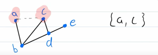

# Stable Matching Problem

For CPS 530 Week 2. **Goals**: sets up issues in algorithm design.

## Sources:

I used a multitude of videos to understand this. I'd start there if you're learning it yourself.

1. [UW CSE442 Visualization Site](https://uw-cse442-wi20.github.io/FP-cs-algorithm/)
2. [Numberphile](https://www.youtube.com/watch?v=Qcv1IqHWAzg)'s explanation without math.
3. [Numberphile w/ Math](https://www.youtube.com/watch?v=LtTV6rIxhdo).
4. MIT's Mathematics for Learning Library.
   * [MIT Stable Marriage Problem Reading](https://openlearninglibrary.mit.edu/assets/courseware/v1/d654c70d7bd563a57216f76bd8bbf308/asset-v1:OCW+6.042J+2T2019+type@asset+block/MIT6\_042JS15\_Session22.pdf)
   * [MIT Open Learning Library](https://openlearninglibrary.mit.edu/courses/course-v1:OCW+6.042J+2T2019/courseware/2123f967fa994ff8a6d8bb681df65745/c722e6fd7da7492d9e165a6c987898e5/?activate\_block\_id=block-v1%3AOCW%2B6.042J%2B2T2019%2Btype%40sequential%2Bblock%40c722e6fd7da7492d9e165a6c987898e5)
   * [6.042J](https://ocw.mit.edu/courses/6-042j-mathematics-for-computer-science-fall-2010/pages/syllabus/) MIT. Especially the [Recitation notes](https://ocw.mit.edu/courses/6-042j-mathematics-for-computer-science-fall-2010/resources/mit6\_042jf10\_rec07\_sol/).
   * [Stable Matching Ritual](https://www.youtube.com/watch?v=RE5PmdGNgj0)

## Questions for Review:

1. Describe the stable marriage problem.
2. What is a perfect match?
3. What is an unstable pair?
4. Know the proof of termination.
5. Know the proof of correctness
6. Write the proof of stability
7. Write an efficient implementation.

## The Gale-Shapley Deferred Acceptance Algorithm (1962)

```
algorithm stable_matching:
		Initialize all men and women to free (unengaged)
		while there exists a free man m who still has a woman w to propose to:
			set w to first woman on m's list to whom m has not yet proposed
			if w is free:
				(m, w) become engaged
			else:
				let m' be w's current fiance
				if w prefers m to m':
					m' becomes free
					(m, w) become engaged
				else:
					(m', w) remain engaged
```

## Scrap Notes

<figure><figcaption></figcaption></figure>

## Class Notes

### Background

* Sweeden awarded them via the Royal Swedish Nobel of Economics and something in Harvard.

### Brute Force Approach

<figure><figcaption></figcaption></figure>

Another example:

<figure><figcaption></figcaption></figure>

## How to Prove Correctness

* **Deterministic**: this algorithm always produces the same result.

#### Termination

* **Observation 1**: men propose to women in decreasing order of preference.
* **Observation 2**: once a woman is matched, she only trades up & is always single.
* **Claim**: the algorithm terminates after at most `n^2` iterations.

#### Perfection

* **Claim**: In Gale-Shapley matching, all men & women get matched.
* Proof is by contradiction
  * Suppose for sake of contradiction, that Zeus isn't matched upon termination of the GS algorithm.
  * Then, there is a single girl must be unmatched & Zeus didn't propose to Amy.
  * Therefore, this contradicts the condition for the while loo because our counter-claim can't be true (that Amy never received a proposal and that cannot happen).

#### Stability

* **Claim**: in Gale-Shapley matching, there are no unstable pairs.
* **Proof**: by **contradiction**.
  * Let's say that for sake of contradiction, it's possible for there to be an unstable pair after the algorithm gets completed.
  * We did an example on the board. See one of the above sources for the proof of stability.

### Efficient Implementation

* We describe an O(n^2) time implementation
* Assume men are named {1, ..., n}
* And the women are {1', ... n'}
* Maintain a list of free men in a stack or queue.
* Maintain two arrays `wife[m]` and `husband[w]`.
  * If `m` matched to `w` then `wife[m] = w` and `usband[w] = m` set entry to 0 if unmatched.

### Proof that women get the worse deal

<figure><figcaption></figcaption></figure>

#### Unorganized

Proof by contradiction?


## Representative Problems

First, we're going to talk about what an independent set is and then go into different ways of solving it.

The problems are all interrelated & variations of this problem

One is solvable by a greedy algorith, another by dynamic, one by network flow, the independent set problem itself (which is NP complete), and one is PSPACE-complete.

### On Independent Sets

[Article](https://www.meltingpointathens.com/what-is-the-maximum-independent-set-problem/)

* **Independent Sets** problems are where we must find the largest set of verticies such that no two are ajacent.
* The problem is NP-complete (very hard) and there's no known efficient algorithm.
* There's a number of approximation algorithms that can find good solutions in polynomial time.
* In this section, we talk about the **applications**: like scheduling, resource allocation, and network design.

### Independent Set Example

* Given a graph `G=(V, E)` find the largest independent set in `G`.
  * Where G is the entire graph.
  * V is a set of vertices
  * E is the set of edges.



* For example, here the set `{a, c}` is an independent set
* **Maximal** independent sets mean there are no vertexes we can add to the graph while preserving independence.
  * Example: `{a, c, e}` is a maximal
  * Non-Example: `{a, b}` are not an independent set because it's connected.
  * `{b}` is a trivial independent set.

<figure><figcaption></figcaption></figure>

## Homework & Implementation

Search my hashmap for `MatchingCPS530` folder. It's currently sitting in the default PyCharm project dir. I also made a Replit. TODO: update with my source code!!


