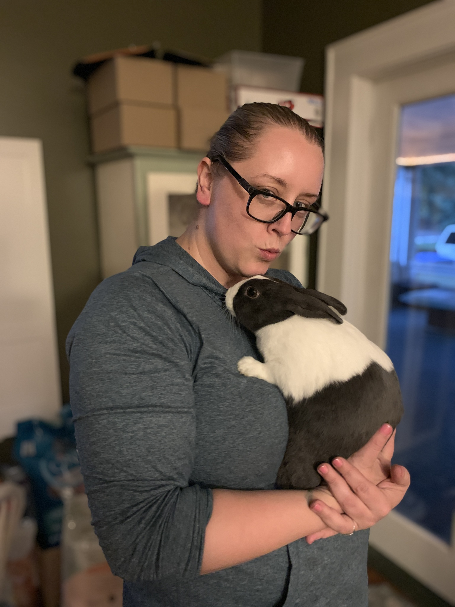

# Ode to BunBunn

.

## Bun-Bun's Owner

<figure><figcaption></figcaption></figure>

## A Hare Raising Tale

<figure><figcaption></figcaption></figure>



## Miscellaneous Quotes

* She used to lick the dandruff off of my hair.
* In some ways, it was lucky I was there
* She knew I was there and I got to hold her and all that when she died.
* Still eat well, still sleep well.
  * After I just had an energy drink.
* When you're sad & you grieve, it makes me tired.
* She'd want me to keep hopping along.
* Doesn't run over to the fridge when I open it.

## Photos

Maybe I should turn this into a Google Site at minimum and put my photos there.

