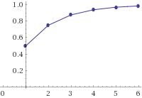

# Amortized Analysis Quiz

## Stack Operations

> Suppose we perform a sequence of stack operations, including push, pop, multipush \(push k items\), and mulitpop \(pop k items\) on a stack. What is the amortized cost if we perform a sequence of n operations on a stack? Explain.
>
> You may use any method that we discussed in class.

### My Response

In the augmented stack in class, we determined that the amortized cost per operation is O\(1\). Although we now have the function multipush, it will take `O(k)` time, which is still constant time.

Using the aggregate method, we can assign each problem a running time. Pushing and popping take `O(1)` respectively. The worst case for multi-pus and multi-pop is `O(n)` time. So the time for the entire sequence is `O(n) + O(n)`. 

And the amortized cost per operation is $$O(\frac{2n}{n}) = O(1)$$ .

## Backup Stack

Let's use the accounting method this time. First, I'm going to use it to show that it won't work in constant time. Second, I will change the budget in order to make it work.

Before I dive into the analysis, let's consider the time for each operation.

| Operation | Time Complexity |
| :--- | :--- |
| Push | O\(1\) |
| Pop | O\(1\) |
| Backup | O\(n\) |

So, interestingly here, we don't have k backup operations, but rather `n` operations because we're backing up the entire stack.

### First Attempt

Let's try giving each of the above operations a budget. 

| Operation | Time Complexity | Budget |
| :--- | :--- | :--- |
| Push | O\(1\) | 1 |
| Pop | O\(1\) | 1 |
| Backup | O\(n\) | 2 |

That's probably not the tightest of bounds, but that will do for now. Let's turn and analyze what happens when we do a certain number of these operations.

| Operation | Explanation | Received | Cost | Account Balance |
| :--- | :--- | :--- | :--- | :--- |
| `push(42)` | Pushes the number 42. | 1 | 1 | 0 |
| `pop()` | Pops the top | 1 | 1 | 0 |
| `backup()` | Backup stack | 2 | 0 | 2 |
| `push(42)` | New number | 1 | 1 | 2 |
| `push(42)` | Another number | 1 | 1 | 2 |
| `push(43)` | A new \# to the stack | 1 | 1 | 2 |
| `push(44)` | Yet another \# | 1 | 1 | 2 |
| `push(45)` | The last one! | 1 | 1 | 2 |
| `backup()` | Gonna run out of money | 2 | 5 | -1 |

So, we ran out of money obviously. So someone in the front of the class asks _"Well just increase the push/pop operation's budget."_ but that is naive. 

### Second attempt

So let's change the budgets.

| Operation | Time Complexity | Budget |
| :--- | :--- | :--- |
| Push | O\(1\) | 3 |
| Pop | O\(1\) | 3 |
| Backup | O\(n\) | 0 |

| Operation | Explanation | Received | Cost | Account Balance |
| :--- | :--- | :--- | :--- | :--- |
| `push(42)` | Pushes the number 42. | 3 | 1 | 2 |
| `push(43)` | Push the number 43 | 3 | 1 | 4 |
| `backup()` | Backup the stack | 0 | 2 | 2 |
| `backup()` | Backup stack | 0 | 2 | 0 |
| `backup()` | Backup stack again. | 1 | 2 | -2 |

And look at that, we ran out of money yet again. If there were 3 elements in the stack, then the cost of backing up the stack would be 3, or 4, or 5 if we kept adding elements before backing them up. So, we need to say we have a hypothetical infinite amount of backups. The only way to make this work is to say the backup takes `n` amount of money. 

### Working Budget

This allocation will work:

| Operation | Time Complexity | Budget |
| :--- | :--- | :--- |
| Push | O\(1\) | 1 |
| Pop | O\(1\) | 1 |
| Backup | O\(n\) | n |

### Conclusions

Clearly, the smallest amount needed is `n` money per backup operation. because that is the only way to make sure our bank account never goes negative.

If we only needed one backup, then we could give it an amortized cost of `O(1)` and give the push operation a higher budget, but since we could call backup many times, the lowest amortized cost is `O(n)`.

## K-Bit Counter

> Suppose we perform a sequence of n incremental operations on a K-bit counter given the counter's initial value is 0. What is the amortized cost after the sequence of n incremental operations is finished? Explain.
>
> You may use any method that we discussed in class.

The amortized cost, which we discussed in class, would be `O(1)`. The worst case cost is `O(n)` because you have to change every bit; however, since there is only an incremental operator, the amortized cost is `O(1)`.

### Aggregate Analysis for the K-Bit Counter

So obviously, by this point, we know two important things. And as a result of these two facts, we know that using amortized analyses is useful.

1. The worst case is `O(k)` because at some point, every single bit gets flipped. _This is when the array is when our_ `list = [1, 1, 1, 1, 1, 1, 1, 1, 1]`and every bit needs to get flipped.
2. Our average case is not going to be our worst case. Clearly, not every bit is getting flipped all the time.

 

![Notice A\[0\] \(At the right\) is flipped every time. A\[1\] \(2nd from right\) is flipped n/2 times, and so on.](../../.gitbook/assets/image%20%2835%29.png)

#### Using Geometric Series

* The pattern we're noticing, `n`, `n/2`, `n/4`... is a [geometric series](https://media.pearsoncmg.com/cmg/pmmg_mml_shared/mathstats_html_ebooks/ThomasCalcET14e/page_592.html) because geometric series have the form:

$$
n + n/2 + n/4 + ... ⇒  \sum _{n=1}^{\infty } 2^{-n}=1
$$

If we graph this, it'll look exactly like this:

So clearly, this is a geometric series, and the series approaches 1:

$$
\sum _{n=1}^{\infty } 2^{-n}=1\
$$

#### Final Conclusions

1. The total cost of the sequence is `T(n) = O(n)`
2. The amortized cost per operation is `O(1)`.

### Accounting Method

* Recall, for the accounting method, we design an amortized cost _\(which is our budget\)_ for increment operations. 
* Here, we declared **our budget is $2**.
* And below, we **prove we have enough budget to cover `n` operations**. 
  * For every bit flip from 0 to 1, we use $1 for the flip.
  * We associate the extra $1 with bit 1, which will be used when we flip this bit from 1 back to 0.

#### Conclusions

Clearly, we have enough budget to cover all the bit flips. This means the balance is never negative. Therefore, we can **conclude** that **since the balance is never negative and our amortized cost for increment operation is $2 which is O\(1\), we can conclude our amortized cost per operation is `O(1)`. and the cost of `n` operations is** $$O(1) * n \in O(n)$$ .

