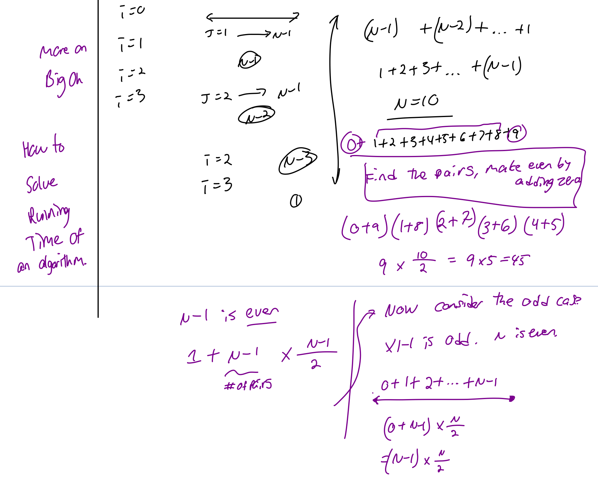
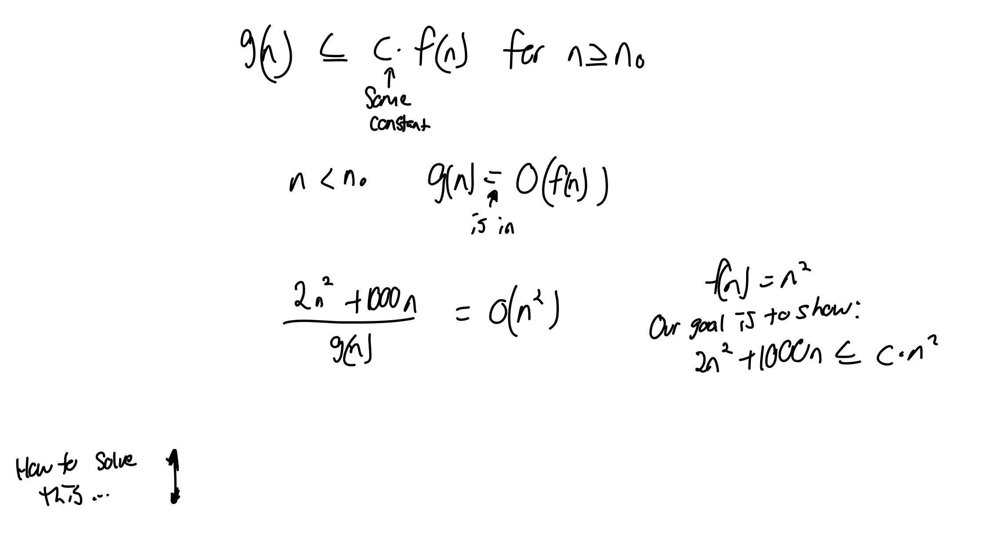
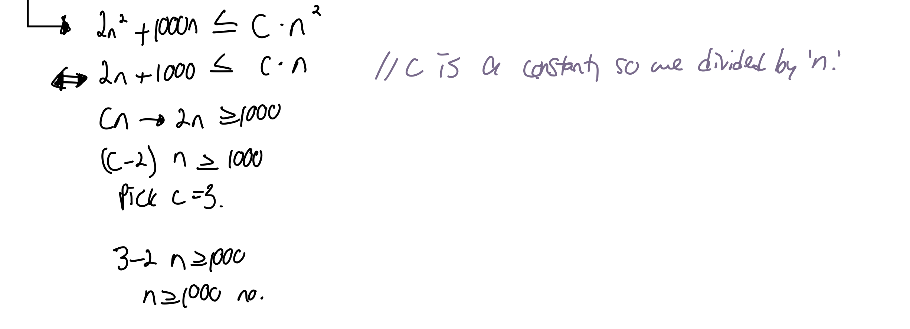
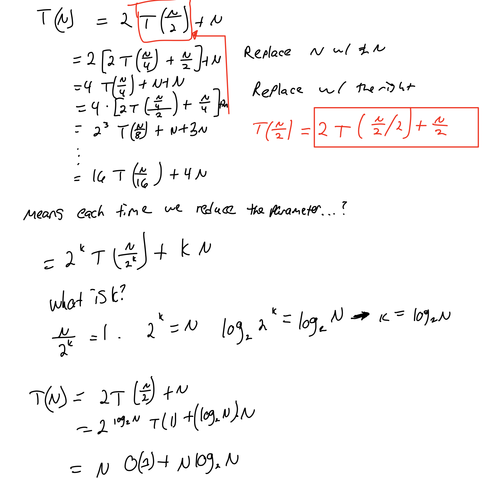
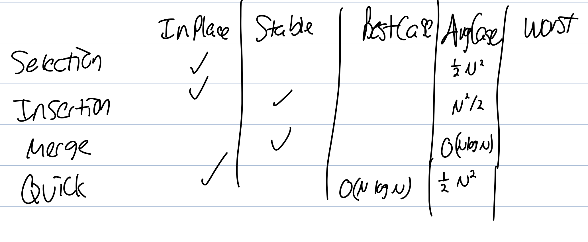

# Untitled

## CPS 350 \| Day 1-5 \| Java Fundamentals

1/14/20-1/28/20

\# Title

\#\# Lecture Focus \(Classes/Objects, Memory, Inheritance, Interfaces\)

\#\#\# Major Sub-Topics

\#\#\#\# Questions, Examples, More

\#\#\#\#\# More if necessary.

### Classes and Objects

#### String Objects

* String reference variables hold the address of the object, not the object itself.

String s = new String\(\);

S = "hi";

String s2 = s; //Copies the address and reference stored in s to s2.

Now s and s2 reference the same object.

//Construct a copy of object, assign its address to s3

String s3 = new String\(s\);

Now s3 points to a new object with the same value.

* In Java, unlike other objects, Strings are immutable menaing once they’ve been constructed, their contents never change.

S2 = s.toUppercase\(\); //a newly created String "HI"

S3 = s.concat\("\*\*"\); //s3 -&gt; a newly created String "Hi\*\*"

#### Default Values of Variables

* instance variables are declared inside a class but not within a method.\* - Instance variables will have default values \(ie. 0 or null\).
* _**Local variables**_ are declared within a method.
  * They do not get a default value.
  * THe compiler will complain if you try to use a local variable before it’s initialized.

**Exercises**

public int getCoinValue\(Stirng coinName\){...}

* coinName is a local variable.
* The parameter can be used within the method.

**Initial Values Exercises**

public class Vehicle{

 Private String type;

 Private int numAxels

 Public Vehicle\(\){...}

* type will be initialized to null.
* numAxels will be initialized to 0.

#### Passing by Value

* When using primitive variables, we make a **copy** of number ‘7’ \(or whatever the primitive data type is\), not the address to RAM.
* Java is pass-by-value, which means pass by copy.

what happens if the **argument** we want to pass is an **object** instead of a primitive?

* We are passing the address of the string, instead of the string itself.
* There are no copies.

What happens if we pass an **array** into a method?

* Arrays are objects. An array variable stores the addresses where the array are located in memory.

/\*\* This practice problem adds up all the numbers in an array \*\*/

public static double sum\(double\[\] numbers\){

 double sum;

 For element:numbers{

 sum = sum + element;

 }

 Return sum;

* Java passes everything by value. When an argument is an array variable, the address of the array object is copied to the parameter in the method.
* For objects, the address is passed.

#### Recap on Classes and Objects

* Let’s define class Node for creating a linked list.
  * Instance variables are public by default unless they are declared as private.
  * They do have initial values \(0 for int, null for strings.

public class Node{

 String item //public

 Node next; //null

 Node n1 = new Node\(\);

 Node n2 = new Node\(\);

 Node n3 = new Node\(\);

 N1.item = "Hi";

 N2.item = "CPS";

 N3.item = "350";

 private void pointToEachOthersAddresses\(\){

 N1.next = n2;

 N2.next = n3; //Get 3's address and put it into n2's next node.

=============

Container 1

-------------

Pointer

==============

* Random: API stands for Application Programming INterface

Q: Can you define class LinkedLIst so that we can write methods for implementing stackAPI?

* A **linkedList** is made of **Node objects**
* We can declare **Node** as a **separate** public class:

public class Node{

 String item; // public

 Node next; // null.

**Question**

* Use the node class in the LinkedLIst

### Memory Allocation in Java

Stacks and heaps are parts of the main memory.

* Java stores program data in two separate pools of memories: the stack and the heap.
* All **objects live on the heap**
* The stack is where method invocations and local variables live.

#### Programs vs. Process

* **Program**: an executable file stores on the system: calculator.exe
* **Process**: an executing instance of a program.
  * Always stored in the main memory.
  * You can have multiple instances of the Calculator program.

#### Memory Allocation

**Address Space**

* Address space: space is allocated for the program/process. No other process can use that space.
* One process cannot even see another’s address space.

Process A:

 Stack // the name of this part of the space.

 \(Allocated space\)

 Heap //THe name of the portions in the space

 Data //

 Text

Process B:

 Stack

 \(Extra allocated space\) //This way, the stack can grow or shrink.

 Heap //You may see a run out of heap space runtime error too. Heaps use the extra allocated space.

 Data

 Text

**Methods are Stacked**

public static void main \(String\[\] args\){

 DoStuff\(\);

Public static void doStuff\(\){

 Boolean b = true;

 Go\(4\);

Public static void go \(int x\) {

 Int z = x+24;

 //more code here.

The stack looks like:

Go\(\)

DoStuff\(\)

Main\(\) //The program finishes when main is popped off the stack.

**Exercise**

public class StackRef{

 Public void foof\(\){

 Barf\(\);

 }

 Public void barf\(\){ //Stored in a stack with 8 bytes.

 //create a duck object, the object is stored on the heap where the object lives.

 Duck d = new Duck\(\); //Stored on the stack.

* Only the reference variable the address of the object goes on the stack. The object itself still goes on the heap.

**Instance Variables**

Instance variables live on the heap inside the object they belong to.

public class CellPhone{

 Private int x; //Occupies 4 bytes

 Private long y; //Occupies 8 bytes.

What if instance variables are object references?

public class CellPHone{

 Private Antenna ant = new Antenna \(\); //ant is an instance variable which lives inside the object.

}

**Summary**

* **local variables** including **parameters** live on the stack **only when** the method they belong to is pushed on the stack.
  * It does not matter if the local variable is a primitive or reference variable.
* **Instance variables** live on the **heap** inside the **object** they belong to.
  * //More here.

**Lifetime of an Object**

Book b = new Book\(\); //object 1

Book c = new Book\(\); //object 2.

An object is alive on the heap **as long as** there’s a reference to it.

b = c; //refer to the same object 2

* When it doesn’t have any pointers attached to it, then it’s **eligible for garbage collection**.
* The JVM \(java virtual machine\) will do the cleaning.

**Destroying Objects**

* We can abandon them and the garbage collector will reclaim the memory the objects were using.

**Efficient Solutions**

1. The references goes out of scope, permanently

void go\(\){

 Life z = new Life\(\); //Reference variable dies at the end of method.

}

1. Explicitly **assign** the reference variable to **null**.

Life z = new Life\(\);

Z = null;

1. The reference is assigned another object: \(double check this code\).

Life z= new Life\(\);

Z = new Life;

**Question: when implementing a Queue in a LinkedList, can you replace the head address to traverse a LinkedList or will it be garbage collected?**

### Inheritance

* Instead of looping through an entire list, use a tail so you can reference the very end.

#### Extends

* We can create a new class called **HeadTailList** that **inherits** the fields and methods of LinkedList, and then write our own insertEnd\(\) in the new class

public class HeadTailList extends LinkedList{ //A subclass of LinkedList

 //The head and size fields are inherited from LinkedList

 Private Node tail; //Add a new field

 Public HeadTailList\(\){

 //LinkedList\(\) constructor is called automatically here

 Tail = null;

 }

 //Methods

* A **subclass** inherits all fields and methods of its superclass.
* A subclass can modify or augment **superclass** in at least three ways
  * It can declare new fields
  * It can declare new methods
  * It can **override** old methods with new implementations

#### Using Multiple Constructors

What happens if we have multiple constructors?

* The zero-parameter constructor in the superclass is always called by default by subclass constructor.
* Calling the constructor in the parent class
* Use the super keyword.
  * super.insertFront\(item\) will call the super method from the parent class.

**Exercise**

This method will add something to the front of the list.

%%Help: might be wrong

public class HeadTailList extends LinkedList{

 //Node, head, and size fields are inherited from LinkedList

 Public void insertFront\(String item\){ //This is what I did and it might be wrong?

 Node nodeToAdd;

 nodeToAdd.item = item;

 nodeToAdd.next = head;

 head = nodeToAdd;

This method will add something to the end of the list.

%%Help: you mentioned subclasses/superclasses here, how were they used? I’m confused at what I can call and when.

public void insertEnd\(String item\){ //Assumes the case handles multiple

 Node nodeToAddToEnd = new Node\(\); //Creates the object.

 //If the list has multiple items{

 nodeToAddToEnd.item = item;

 nodeToAddToEnd.next = null;

 tail = nodeToAddToEnd;

 //If the list has one item{

 if \(size.isEmpty\(\)\){ //Don't use the size.?

 }

#### Review of Inheritance

* A subclass inherits all fields and methods of its superclass. It can declare new fields & methods.
* We can use the super keyword to call a method or constructor from a parent class.

### Interfaces

* Interfaces are very similar to abstract classes.
* You can only extend one parent class, so if you need to extend from multiple parents, you can implement many interfaces \(as many as you want\).
* Uses the keyword implements &lt;interface&gt;, &lt;another interface&gt;, &lt;even more&gt; in the class.

 public class LinkedList extends List implements Comparable, Iterator{ ...}

#### Abstract classes

* An abstract class is a class whose sole purpose is to be extended for multiple classes to share.

 public abstract class List{ //Use the abstract keyword to implement

 //Variables

 Protected int size;

 Public abstract void insertFront\(String item\); //An abstract method ensures that every non-abstract subclass will implement this method.

* If you want to create a new abstract object, it’s not allowed in Java.
* You can have a reference variable containing a variable in an abstract class \(even though it’s not part of the object.

#### Dynamic Method Lookup

Dynamic lookup is ::Help: insert more here::

* Every object of a subclass is an object of the superClass \(with less fields/methods\). The reverse is not true.
* Any subclass object can be assigned to a superclass variable, which is called _**polymorphism**_

 LinkedList l = new HeadTailList\(\);

* We can pass superclass object or any subclass object at runtime.

**Exercise**

Refer to the PowerPoint, I’m going to write what I think the output will be. This is useless. ::TODO:Figure this out::

I should go see her or her TA during the office hours to re-learn interfaces and inheritance.

**Aside: Assignment 1 Discussion**

public void enque\(T item\){

 If \(size == queue.length\){ //You have to see if the Array if full. If it's equal, you used all the spots in the array.

 resizeArray\(queue.length\);

 }

 Q\[back\] = item //The back's initial is zero. It decreases back by 1?

 Back ++;

 Back = back % Q.length; //Divide the current back the the current array size. If it's zero, it points to an item at element zero.

 Size++;

}

Public T dequeue\(\){

 If\(isEmpty\(\)\){

 Throw new java.util.NoSuchElementException\(\);

 }

 T value = Q\[front\]; //The index front pointing to the front item. Since it's not empty, you can get it and save it in the value.

 Front++ //so front moves to the next element

 Front = front % Q.length; //You have to do the modulus calculation if the index in the front move to the beginning item.

 Size--;

 Return value;

}

Private void resizeArray\(int oldSize\){

 newSize = 2\*oldSize;

 T\[\] newQ = new T\[newSize\]; //New Queue is the new array.

 For \(int i = 0; i &lt; oldSize; i++\){

 NewQ\[i\] = oldQ\[front\];

 Front ++;

* After you resize, the front will be the beginning of the new array.
* The back will be where the array ends.

### Genetic Components

What if we want a stack of apples?

#### Generic Stack

* If we use the keyword object, this can be any class name.
* When we use objects, this causes bugs.
* All the items on the stack should be the same type, so **tighter type** was made.

#### Tighter Type

public class ListStack&lt;Type&gt; //Type is a placeholder for the type of items in the data structure.

* The Type surrounded by angle brackets &lt;&gt; is a placeholder for an actual type of object.
  * Type can be replaced with any other name: E, T, TYPE, AnyType
  * It can be any non-primitive type you specify \(any class type, any interface type, or any array type\).

//In Main

ListStack&lt;String&gt; s = new ListStack&lt;String&gt;\(\);

s.push\("Hi"\);

s.push\(10\); //ERROR.

* We can only use concrete class types, not primitive types when doing this.

**Practice: Array Implementation Using a Generic Stack**

There are two approaches. You can either re-index every time you add a new item into the array or you have a counter pointing to the next spot for the new item.

public class ArrayStack&lt;Type&gt;{

 private Type\[\] s; //generic array

 private int top = 0; //next empty spot

 private int capacity = 10;

//Make a constructor

 public ArrayStack&lt;Type&gt;\(\){

 s = new Object\[capacity\]; //not a good idea

 s = new Type\[capacity\]; //Won't run; generic array creation is not allowed in Java.

 s = \(Type\[\]\) new Object\[capactiy\] //Typecast Object =&gt; Type.

 public boolean isEmpty\(\){

 return top == 0;

 }

 public void push\(Type item\){

 if \(arrayIsFull\(\)\){

 resizeArray\(\);

 if \(isEmpty\){

 public Type pop\(\) throws NoSuchElementException{

 toPop = s\[rear\]

 if \(isEmpty\(\)\){

 throw new NoSuchElementException\(\);

 Type x = s\[top\];

 s\[top+1\] = null; //Not needed because array is same size. Setting to null is wasted time.

 top --;

 return x;

 }

* This code is incomplete
* As a workaround, create an array of objects and then insert type cast to preserve type.
* If nothing is pointing to the new array, the array that was referenced by s is eligible for garbage collection.

**Autoboxing**

* Each primitive type has a wrapper object type
* Autoboxing is an automatic cast

## Analysis of Algorithms

1/30/20

\# Title

\#\# Lecture Focus \(Classes/Objects, Memory, Inheritance, Interfaces\)

\#\#\# Major Sub-Topics

\#\#\#\# Questions, Examples, More

\#\#\#\#\# More if necessary.

### Analysis of Algorithms \| Day 6

#### Introduction

Questions we’ll ask:

1. Why are programs slow?
2. Why did I run out of memory?

Cast of characters:

1. Programmers need to develop a working solution
2. Clients want problems solved efficiently.
3. Theoretician does other stuff I don’t care about.

**Algorithm Analysis**

**Question**: Consider the following program segment. It’s a nested loop. What is the value of x at the end? \(Ie. How many loop iterations as a function of n?\)

x = 0;

For i = i to n do

 For j = 1 to i do

 X := x+1;

* _**x**_ is the run-time of the algorithm.
* _**n**_ is the size of the problem.

**Discrete Sums**

**Q: How do you compute a discrete sum?**:

**Estimating Sums**

If you just want to estimate the sum, replace the sum with the integral and use calculus.

**Exact Sums**

You can type 1+2+3+...+n into Wolfram Alpha to find the exact sum.

The integral is just a summation

* Prove by induction
* Big Oh notation
* Recurrence relations
* Space

#### Prove by Induction

* f\(n\) or Running time means the number of statements or iterations.
* Typically a mathematical proof.
* Typically used to establish a given statement for all natural numbers.
* Suppose P\(n\) is some statement \(mentioning integer n\). Like n&gt;= n/2+1

**Example**

1. Prove the “base case” ie P\(n0\), where n0 is usually 1.

1. Assume the statement holds for P\(k\) for k&gt;n0

Assume f\(k\) = 1+2+3+... + k = \(1/2\)\(k\(k+1\)\) is true for K&gt;N0 = 1. We need to show if the result is true for f\(k+1\) = 1 + 2 + 3 + ... + K + K+1 = \(1/2\)\(k+1\)\(k+2\)

To this end: f\(k+1\) = 1 + 2 + 3 + ... + k + k+1

//Something else on the board; I missed it.

1. Prove the “inductive case” ie. If P\(k\) is true, then P\(k+1\) is true.

**Example**

P\(n\) = “the sum of the first n powers of 2 \(starting at 2^0 is 2^\(n\)-1”

* We will show that P\(n\) holds for all n &gt;=1.

**Another Example**

This is the selection sort algorithm, see the corresponding slide. It's much later, but we talked about it again.

### Big Oh Notation \(Feb 4, 2020\)

#### Debugging in Eclipse

* Watch some videos on Youtube so you can understand how to use the nice features.
* Use the Eclipse Debugger or use System.out.println to print out variables on the screen to seen how the program is operating.

#### Recall: Analyzing Programs

x:=0

for i = 1 to n do

 for j = 1 to i do

 x = x+1;

 The total number of loop iterations is nx\(n+1\)/2.

* This is a very common loop structure worth memorizing.
* It’s proportional to n^2.
  * n\*\(n+1\)/2 = \(n^2+n\)/2
  * For a large enough n, the lower order and constant terms are \_.

#### Definition

**Definition**: g\(n\) is in O\(f\(n\)\) if there exist positive constraints c and n0 such that g\(n\) ,= cf\(n\) for all n&gt;= n0.

**To get the code and finding Big-Oh**:

1. Add up the time for all parts of the algorithm ie. The number of iterations = 1+2+…+n = n\(n+1\)n/2
2. After, eliminate low-order terms. eliminate \(n/2\):\(n^2/2\)
3. After, eliminate coefficients \(eliminate 1/2\):\(n^2\); We write: n^2/2 + n/2 O\(n^2\).

**Example**

* g\(n\): the running time of an algorithm such as \(n^2/2\)+\(n/2\)
* g\(n\) &lt;= \(upper bounded by\) c\*f\(n\). C is some constant.

Below, we try to make something easier to get a right answer. Make things easier.

1. Drop the lower order term
2. Drop the dominant term.
3. Ignore the coefficient?

**Example \#2**

Can you prove that g\(n\) = 0.5n^2+100n is in O\(n^2\)

**Example \#3 ::TODO: Understand::**

If g\(n\) is in O\(f\(n\)\), we write g\(n\) = O\(f\(n\)\). **Is n^2** = O\(n\)?

* No. n^2 &lt;= cn.
* n&lt;=c.
* The above inequality cannot be satisfied since c must be a constant.

Q: Is n^2 = O\(n^3\)?

* Yes
* n^2 &lt;= cn^3
* 1 &lt;= cn
* Pick c=2 and n0 = 1 n^2 &lt;= 2n^3 is true for all n&gt;1.
* 3n^2+17 is also in O\(n^3\) and O\(2^n\).
* **We’re interested in the tightest upper bound:**  3n^2+17 = O\(n^2\).

#### Common Names of Notations

### Recurrence \(Recursive\) Relations

#### Linear Search

* Is the key inside a sorted array.
* Best Case: \(1\).
* Usual Case \(a.length\).
* Worst Case: n.

#### Binary Search

See the slides for the actual code. What I’ve written is not good, accurate, or works.

* If you see t, it usually means the time for size n in our notation. ie. T\(n/2\)
* You keep cutting the problem set in half.
* Requires that the given array is sorted.

Basic Version:

public static int binarySearch\(int\[\] a, int key\){

 Return help\(a, key, 0, a.length - 1\); //T\(n\) for size n

}

public static int help\(int\[\] a, int key, int lo, int hi\){

 If lo&gt;high

Larger version:

public static int binarySearch\(int\[\] a, int key\){

 while \(low &lt;= high\){

 int middle = \(high-low\)/2+low;

 //Famous 3-way comparison

 if \(key == a\[middle\]\){

 return middle;

 }

 else if \(key &gt; a\[middle\]\){

 10 - middle + 1;

 }

 else{ //udpate the low and the high

 high = mid-1;

 }

 return -1; //If the thing is not in the array, use -1 to show it's not in the array.

**Example ::Todo: Understand::**

Find an integer in a sorted array. Design the recursive function.

public static int help \(int \[\] a, int key, int low, int high\){

 if \(low &gt; high\){

 return -1;

 int mid = low + \(high-low\)/2

 if \(key =- a\[mid\]\): return mid;

 else if \(key &gt; a\[mid\]\){

 return help\(a, key, mid + 1, high\);

}

Next time: can you find the running time of a recursive.

#### Solving Recurrence Functions

**Find the Run Time of Binary Search**

### Sorting

#### Elementary Sorts

**Selection Sort**

* The worst case scenario is that the inner loop almost never breaks: 1+2+3+... + \(N-1\) ≠= N^2/2 where ≠= means approximately.
* Average case: inner loop breaks about half-way.
* Best case: about linear.
* Swap each largely entry to its left.

public static void selectionSort\(int\[\] a\){

 Int N = a.length;

 For \(int i = 0; i &lt; N; i++\){

 Int indexOfMinimum = i;

 for \(int j = i+1; j&lt;n; ++j{ //runs faster than j++

 if\(min &lt; a\[j\]{

 Min = a\[j\]

 IndexOfMinimum = j;

 }

 }

Private static void swap\(a, i, indexOfMinimum\){

 //Divide and conquer to solve big problems. Write a method for doing these little things.

#### Insertion Sort

My code:

public class Insertion{

 Public static void sort\(int\[\] a\){

 for \(int i= 1; &lt; N; i++\){ //N is length

 //Find the right spot for each item.

 int copy = a\[i\];

 for \(int j = i-1; j &gt;= 0; j--\){

 if \(a\[j\] = a\[i\]\){

 A\[j+1\] = a\[j\];

 A\[j+1\] = copy //Need a blank space for the new thing to be copied to.

 Else break;

 }

**Which is the best?**

* If inserting a new thing into a sorted array, choose insertion sort.
* If sorting lots of new numbers or it’s unsorted, then choose insertion sort.

**Running Time**

The insertion sort has a run time of N^2.

#### The Comparable Interface

In the comparable interface, specify a set of methods that a concrete class can provide. A concrete class can provide the set of \_.

public interface Comparable&lt;Item&gt; {

 Public int compareTo\(Item that\);

} //java.lang.Comparable

* Implement compareTo\(\) so that v.compareTo \(w\)\{...}

You have to implement an interface in the method head:

public class Date implements Comparable&lt;Date&gt; {

 Private final int month, day, year;

 Public date\(int m, int d, int y\){

 Month = m; day = d; year = y;

 }

 Public int compareTo\(Date that\) { //Could be written in one line...

 Int result; //Save the result into this.

 if \(this.year &lt; that.year\){

 Return this.year-that.year;

 }

 Else if \(this.month &lt; that.month\){ //Year is the same

 Return this.month-that.month;

 Else if \(this.day &lt; that.day\){

 Return \(this.month &lt; that.month\)

 }

 Else{

 return zero;

public static void insertionSort\(Comparable\[\] a\){

 int N = a.length;

 For \(int i = 0; i &lt; N; i++\){

 For \(int j = i; j &gt; 0; j--\){

 If \(a\[j\].compareTo\(a\[j-1\]\) &lt; 0 //just call the method

 Each\(a, j, j-1\);

 Else break;

}

**De-Coupling** means sorting complex functions into many smaller functions, which is important in Java.

#### The Comparator Interface: Overview

The overview lets you do things in many other ways, for example, in class, we talked about using...

* The method is compare\(Item v, Item w\).

public interface Comparator&lt;Item&gt;{

 Public...

In main, you say:

//In Main

Student\[\] a;l

 //fill in array a.

Insertion.sort\(a, Student.bySectionOrder\(\)\);

If we want to sort students by a student’s name:

public static Comparator&lt;Student&gt; byStudentName\(\){

 Return new sectionOrder\(\){

 //Return the object of the comparator.

 Return new NameOrder;

}

Public static Comaprator&lt;Student&gt;{

 Return new GPAOrder; //

}

Private static class NameOrder implements Comparator &lt;Student&gt;{

 Public int compare\(Student v, Student w\){

 return v.name.compareTo\(w.name\); //Pass the object to that.

 qdouble r = v.GPA - W.GPAfor r == \)

 if \(r == 0\) == 0

 }

}

Now, we can pass this to Insertion Sort via

Insertion.sort\(a, Student.byNameOrder\(\)\); //Now it will sort the students based on the name order. You can call the static method.

#### Stable Sorts

* Covered in class, but I wasn’t there. See the PowerPoint.
* **Stable** means that the order is preserved?

#### Merge Sort

**Memory & In-Place**

* A sorting algorithm is **in-place** if it uses &lt;= c\*log\(N\) extra memory.
* Selection sort is in-place because it doesn’t use extra space or create any new arrays.
* Insertion sort is also in-place because it doesn’t use extra space.
* Merge-Sort requires extra space because it requires an extra array. Therefore it is not in-place

**Stable**

A sorting algorithm is stable if it preserves the relative order of equal keys.

* There is a slide on this.
* The merge operation is stable.

**Running Time of Merge-Sort**

* The recursion “tree” will have log\(N\) height
* We need to do \(N\) calculations per layer.
* The merge sort, which uses a binary tree has log2\(N\)+1 layers.
* **Mergesort’s running time is O\(N\*log\(N\)\)**
* Formally, it’s T\(N\) = 2T\(N/2\) + N + 1. We only keep the N though because it’s the highest term.

* TODO: go over the steps with Dr. Yao or Josh later because I don’t get this.
* TODO: Understand what keys are

**Improvements to MergeSort**

* Pass through array, merging subarrays of size 1
* Repeat for subways of size 2, 4...
* Bottom Up MergeSort

//Bottom-Up MergeSort slide where the table MERGESORTEXAMPLE gets sorted.

merge \(a, aux, lo, lo+s2-1, \(lo+s2\*2-1\)

Merge \(a, aux, 0, low+size-1, 7\)

* Using this bottom-up means we won’t have any recursive sort methods?

-

#### Sort

* You have a group of numbers that are not sorted. We’ll have a pivot point. Any number that is smaller goes on the left. Any number that’s bigger goes on the right. Then you’ll have to groups of things.
* The pivot point will be at the middle of the array after the first quick sort.
* 52948316, if the pivot point is 5, it becomes 32145896.
* You have to write a special case for when you get down to just two elements.
* **Quick sort will be fully in our exam**.
* ::help, I don’t understand partitioning.::
* Has a running time of **O\(N\)**.
* Running time for the partition method: **N+T\(N/2\)+T\(N/2\)**

**Implement QuickSort**

This is what I wrote, but it’s sort-of wrong.

private static int partition\(Comparable\[\] a, int lo, int hi\){

 //lo &lt; hi: \[lo, high\] containing at least two items.

 Int i = low;

 Int j = hi;

 Int pivot = low

 While\(true\){

 While \(less\(a\[i\], pivot\)\){ //move i to the right until.

 i++;

 }

 While \(less\(a\[j\], pivot\)\){

 J--

 Exchange\(a, i, j\);

 }

* Also said it’s N^2.

**Properties of QuickSort**

* It is not stable
* The time complexity is N^2, I think?
* Average case is n\*log\(N\)

**Practical Improvements**

* Choose the median number as the pivot. Typically 14% fewer comparisons.

#### 3-Way QuickSort Partitioning

* Improves QuickSort when there are duplicate keys.

#### Assignment 2 Notes

**Term**

* If weight is small, it’s not a popular term. If it’s large, it’s a popular term.
* Receives the query and the weight.

Comparing Terms

* We want to sort from the largest value to the smallest value.
* We want to receive the term with the maximum weight and show that at the beginning.
* If the first term’s weight is smaller.
* You’ll return a new object return new ReverseWeightOrder\(\);.

public static Comparator&lt;Term&gt; byPrefixOrder \(int r\)

* Compare two terms.
* Do not lookat the whole string, but just the first r characters in the string. If you look at the first 3 characters.
* You get a substring String a = o1.query.substring\(0,Math.min\(r, 01.query.length\(\)\)\);

**In.java**

* don’t change anything

**BinarySearchDeluxe**

**Autocomplete**

* This is completed by Princeton’s professor.
* There’s a text-only debugging interface in the Autocomplete.java with a simplified main.
* Project properties: setup arguments: wictionary.txt 7. Right click on project name -&gt; properties to setup arguments.
* Use the simplified Main method first.

#### Bucket Sort/Radix Sort

When we sort objects, we sort them using a key. The key is an integer in our case, but it could be a GPA or name. In an array, it tells you where the index is.

* **Key-Indexed Counting**: Goal: given an array a \[\] of N objects, sort them based on their integer keys between 0 and r-1.
* For example, you can rank the food in KU between 0 and 5 on satisfaction. Then you can count the frequency of each rating given by each user.
* **Keys** are the things inside the brackets.

Int \[\] count = new int \[6\];

for \(int i = 0; i&lt;array.length; i++\){

 If \(a\[i\] == 0\){ //Save the thing in an integer

 Count\[0\]++;

 Else if \(a\[i\] ==1\){

 Count\[1\]++;

 Else if \(a\[i\] ++ //Use switches

 .

 .

 .

//A better version

Int \[\] count = new int \[ratings\] //Ratings = 6.

For \(int i = 0; i &lt; a.length; i++\){

 Count\[a\[i\]\]++; //Case key is the index of the array counter.

}

//Now we have an array.

//Now copy the new array back into the original array

Public void copyBackToOriginal\(\){

Int k = 0;

For \(int i = 0; i&lt;count.length; i++\){

 Int tempCount = 0;

 For \(int j = 0; j&lt;count\[i\]; j++\){

 A\[k++\] = i; //Post-fix add up or something? This will not work if they're objects. But you can do a\[i\].key.

 }

}

**Bucket-Sort: Key Indexed Counting**

//For all of these

Int N = a.length;

Int\[\] count = new int\[R+1\] //r is

1. Count frequency of each integer using key as index:

for \(int i = 0; i&lt;N; i++{

 Count\[a\[i\].key + 1\]++;

1. Cumulative frequency \(with specific destinations\)
   1. We have 6 keys that share smaller than 3.
   2. We have 8 keys that are smaller than 4.
   3. count\[r\] means there are n keys that are smaller than 2.

for \(int r = 0; r&lt;R; r++{

 Count\[r+1\] += count\[r\];

}

1. Access cumulative frequency using key as index to move items.

for \(int i = 0; i&lt;N; i++\){

 Aux\[count\[a\[i\]\]++\] = a\[i\];

}

1. This one is complicated and uses a helper array.
2. Copy back into the original array

for \(int i = 0; i &lt; N; i++\){

 A\[i\] = aux\[i\];

}

**Analysis**

* The run time for all of this is 3n+r. Or **O\(n+R\)**
* It is stable, we didn’t change the order.

#### Radix Sort

* We’ll sort things digit by digit.
* Start with the least significant digit. “You’d better remember their relative order in the original array?”
* Next, sort the 10’s place. The 1s will be in the front.
* Then, look at the hundreds place, so you pad it with zero.
* Then, look at the thousands palace.
* See 15 sorting algorithms in 6 Minutes.
* Don’t change the keys.

#### Summary of Sorting Algorithms

::Paste PowerPoint slide here::

* R is a range of the value of the keys.
* Radix-sort won’t be on the exam.

#### Project Notes

1. Call the library Array.sort during debugging and then replace with your own.

### Heaps

* Each incoming job and task has its own key and priority.
* Smaller keys mean they have a higher priority.
  * If it’s a stack, delete the item most recently added.
* Each time we get the smallest item for sorting,

## Heaps and Heap-Sorts

#### Assignment 3 Help

1. Use the Array.sort method while you’re debugging.
   1. Use Array.last.

Website Scratch

public class SwitchDemo {

 public static void main\(String\[\] args\) {

 int month = 8;

 String monthString;

 switch \(month\) {

 case 1: monthString = "January";

 break;

 case 2: monthString = "February";

 break;

 case 3: monthString = "March";

 break;

 case 4: monthString = "April";

 break;

 case 5: monthString = "May";

 break;

 case 6: monthString = "June";

 break;

 case 7: monthString = "July";

 break;

 case 8: monthString = "August";

 break;

 case 9: monthString = "September";

 break;

 case 10: monthString = "October";

 break;

 case 11: monthString = "November";

 break;

 case 12: monthString = "December";

 break;

 default: monthString = "Invalid month";

 break;

 }

 System.out.println\(monthString\);

 }

}

