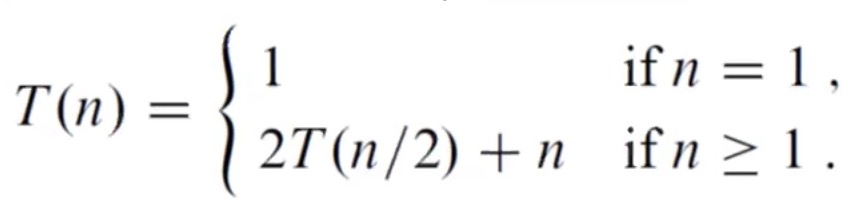

# Lecture 04: Divide and Conquer Methodology

## Goals

1. Analyze the running time for divide/conquer algorithms.
2. Understand and apply this strategy.

## General Technique

1. **Divide** the problem into sub-problems.
2. **Conquer** sub-problems by _recursively_ solving them.
3. Solve the **base case** when problems are small enough to solve by brute force.
4. **Combine** solutions to sub-problems to build a solution to the original problem.

In more detail:

> 1. **Divide** and break up the problem into the smallest possible “subproblem”, of the exact same type.
> 2. **Conquer** and tackle the smallest subproblems first. Once you’ve figured out a solution that works, use that exact same technique to solve the larger subproblems — in other words, solve the subproblems recursively.
> 3. **Combine** the answers and build up the smaller subproblems until you finally end up applying the same solution to the larger, more complicated problem that you started off with!


Example:

In sorting algorithms, sometimes we divide arrays into smaller arrays so we can solve each small part by brute force and put them together.


### Example: Merge Sort

[Merge sort](https://medium.com/basecs/making-sense-of-merge-sort-part-1-49649a143478) works in 3 steps:

> The _**merge sort algorithm**_ is a sorting algorithm that sorts a collection by breaking it into half. It then sorts those two halves, and then merges them together, in order to form one, completely sorted collection.

#### Merge Sort Implementation

```javascript
function mergeSort(array) {
  // Determine the size of the input array.
  var arraySize = array.length;
 
  // If the array being passed in has only one element
  // within it, it is considered to be a sorted array.
  if (arraySize === 1) { 
    return; 
  }
 
  // If array contains more than one element,
  // split it into two parts (left and right arrays).
  var midpoint = Math.floor(arraySize / 2);
  var leftArray = array.slice(0, midpoint);
  var rightArray = array.slice(midpoint);
 
  // Recursively call mergeSort() on
  // leftArray and rightArray sublists.
  mergeSort(leftArray);
  mergeSort(rightArray);
  
  // After the mergeSort functions above finish executing,
  // merge the sorted leftArray and rightArray together.
  merge(leftArray, rightArray, array);
  
  // Return the fully sorted array.
  return array;
}

function merge(leftArray, rightArray, array) {
  var index = 0;
 
  while (leftArray.length && rightArray.length) {
    console.log('array is: ', array);
    if (rightArray[0] < leftArray[0]) {
      array[index++] = rightArray.shift();
    } else {
      array[index++] = leftArray.shift();
    }
  }
  
  while (leftArray.length) {
    console.log('left array is: ', leftArray);
    array[index++] = leftArray.shift();
  }
  
  while (rightArray.length) {
    console.log('right array is: ', rightArray);
    array[index++] = rightArray.shift();
  }
  
  console.log('** end of merge function ** array is: ', array);
}

```

#### Analyzing the Running Time of Merge Sort

* _\(n/2\)_ is the **split** \(divide\) part of the routine.
* _2_ is the 2 additional calls that are created.
* _O\(n\)_ is the merge subroutine.
* Divide & Conquer Increases efficiency.
  * For Merge Sort, we took an algorithm that is normally O\(N^2\) and made it O\(n\*log\(n\)\).

### Example: Closest Pair of Points


This example is from _Back to Back SWE,_ entitled _Divide and Conquer Methodology_. It will not make sense unless you watch the video at 4:02.


* Given a plane with a set of points `P1, P2... P6`, what is the closest set of points in the plane.
* We have an x-y coordinate mapping and we can see with our eyes what the answer is.

#### To solve quadratically:

1. There is nC2 ways, or n! ways to connect the points. That's O\(n^2\).
2. Solve by brute force: 2 for loops comparing points.

#### To solve using Divide & Conquer

1. Take a vertical slice of the points. 
2. **Split** the first input in half vertically.
   1. Find the closest points in the left half to the line.
   2. Find the closest points in the right half to the line.
3. **Merge** them in linear time _\(not explained here\)._

### Example: Binary Search

1. Divide the array into two halves by comparing the midpoint.
2. Check if the key is equal to the midpoint
   1. If the midpoint is equal to the key, return it and we're done.
   2. If it's higher/lower, invoke the higher/lower.
3. Once you find the index, return that index. _Unless it doesn't exist, in which case we return -1 meaning it doesn't exist._

```java
// require: array a is sorted
public static int binarySearch(int[] a, int key){
    return help(a, key, 0, a.length-1);
}
public static int help(int[] a, int key, int lo, int hi){
    if (low > hi) return -1;
    int mid = low + (hi-lo) / 2;
    if (a[mid] == key) return mid; //If the middle is the key.
    else if (a[mid] < key) return help(a, key, mid+1, hi);
    else return help(a, key, lo, mid-1)\
}
```

### Example: Find the Maximum Number Given an Unsorted Array

1. **Split** the array in half \(recursively until it gets really small\).
2. **Compare** each super small number with each other.
3. **Return** the larger number all the way back up. And compare over and over until you're left with only one solution to the original problem.

```java
public class Main{
    public static void main(String[] args) {
        System.out.println("Divide & Conquer! \n");
        
        //Initialize an array of numbers.
        int[] numbers = {2, 3, 5, 2, 7, 3, 4};
        
        //Print out the array's maximum number.
        System.out.println("The array's maximum number is: " + findMax(numbers));
    }
    
    //Returns the maximum number in the array list.
    public static int findMax(int[] list){
        //Three arguments: the list, low, and high.
        return help(list, 0, list.length);
        
    
    }
    //This is our recursive helper method.
    public static int help(int[], int lo, int hi){
        //Base case: the array only has 1 element.
        if(lo == hi) return list[lo];
        
        //General case: range has 2+ items.
        //Divide:
        index mid = lo + (hi - lo) / 2;
        
        //Left half: [lo, mid]
        int lMax; //Maximum number in the left half, low to mid.
        lMax = help(list, lo, mid); //Recursive call.
        
        //Right half: [mid+1, hi]
        int rMax;
        rMax = help(list, mid + 1, hi);
        
        if (lMax >= rMax) return lMax;
        else return rMax;
        
}
```


## Analyzing Running Time

When we analyze the running time of recurrence functions, we do so using piecewise functions. 



## Work Cited

1. [Making sense of merge sort](https://medium.com/basecs/making-sense-of-merge-sort-part-1-49649a143478) _\(definitions and merge sort implementation\)._
2. Dr. Zhongmei Yao's [CPS 450 course](http://academic.udayton.edu/zhongmeiyao/450592.html). _\(Content not used, but was taught\)._

