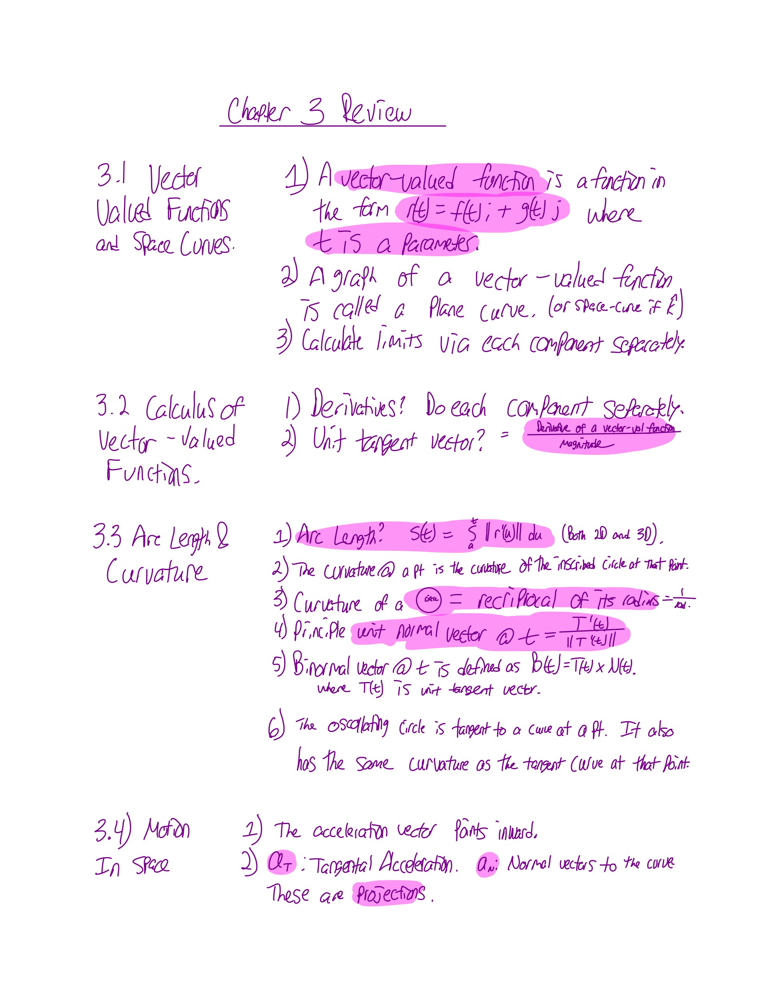

# CH3: Vector valued Functions



## Formulas

## Key Concepts

### 3.1: Vector Valued Functions and Space Curves

### 3.2: Calculus of Vector-Valued Functions

### 3.3: Arc Length and Curvature

### 3.4: Motion in Space

## My Open Math

### 3.1: Vector Valued Functions

#### 3.1.1: Match each graph with it's equation

Here, we're asked to match graphs with the equations that describe them.

If you come across a tough one, search "Parametric Plot &lt;function&gt; &lt;range of t&gt;" on Wolfram Alpha to see the graph.

#### 3.1.2: 

## Works Cited

* All problems are completed by Michael Chase
* Review sections come from the text cited at the top:[ "Calculus Volume 3" by Edwin Herman and Gilbert Strang. ](https://openstax.org/details/books/calculus-volume-3)

