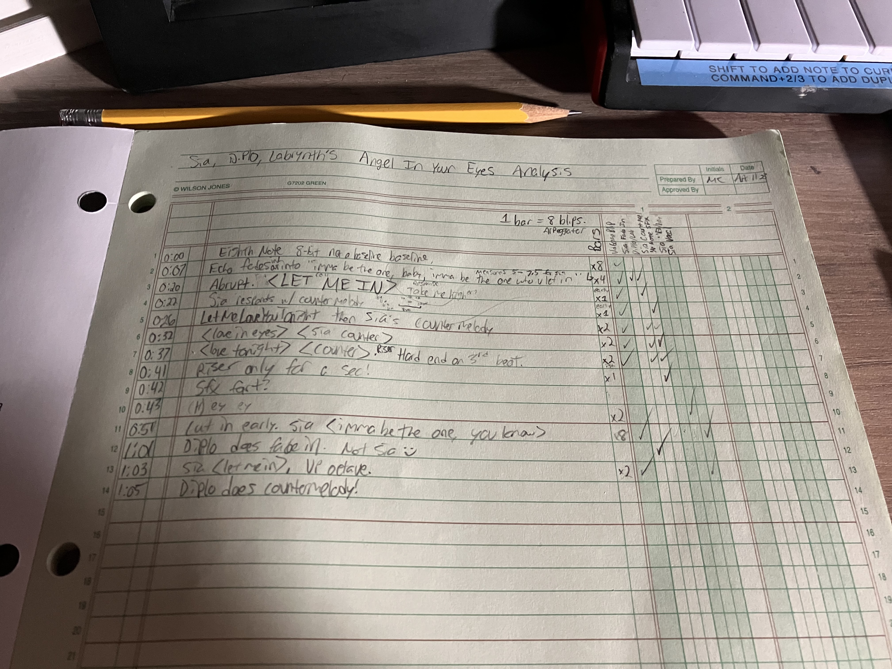

# 2023 Favorite Music

## LSD (Labrynth/Sia/Diplo)

I'm up for a security clearance review soon, so I shouldn't be talking about LSD too much on my website someone might be investigating but damn - this might be one of my favorite albums of all time because it's so beautifully composed.

The second song is called _Angel in Your Eyes._ I haven't looked up what it's exactly about and I do not want to spoil the magic & connection it means for me, but to me, it's one of my favorite compositions and I'd never think twice of it. The first seven seconds starts out with just eighth notes so I was quick to make fun of it & discard it as a stupid song; however, whoever composed it does a tremendous job of taking stupid arpeggiated 8-bit eighth notes and blending it in such a way it became almost like a baseline even though it's an octave or two up where most baselines are so I hesitate to use that term.

Maybe the reason I love it & am so excited about it is the fact that it's almost indescribable. I have studied piano for nineteen years now and it's so cohesive & makes sense but is indescribable using words in my musical vocabulary. At 0:07, there's small vocal fade-ins which is nothing new but I appreciate how Sia worked her way in. When it's Sia's turn to produce vocal lyrics/melody, Diplo or Labrynth come in & have an opposing countermelody.&#x20;

Perhaps my favorite part of the album is that I'm rarely bored. Like any album, hearing the music over and over gets repetitive, but I can continue analyzing it over and over. There's a classic jazz "call-and-response" feel with this and many of the other songs which is quite suitable for the topic of love.

The album isn't too serious about love and it's titled LSD, but if I used drugs and were living that lifestyle I'd imagine this is awfully relevant. I don't do drugs but went to college & know some people who do and I so, and this album is so fast-paced and amazing that it would make drug-users like it (though maybe I'm overestimating their comprehension & few others analyze songs like an engineer. I'll probably find/make a lead sheet for one or two songs down the road & try to study/reproduce it for the sake of learning one day.&#x20;

<figure><figcaption></figcaption></figure>

The other part is it's so rhythmically interesting. In the song `Genius`, the meter is in 4/4, but it could be 12/8 or 12/4 because Sia sings over it sometimes in triplets.

I am so excited about this album because of how happy & energetic it makes me feel! The bass and drums are perfectly in tune, and the vocals and instruments harmonize beautifully. I even think the sound effects are well-integrated into the music. I need to do more analysis to fully appreciate it, but I can already tell that this is a special album. I've cried a few times and I can only speculate what the lyrics all mean but it applies to my life nonetheless.&#x20;

\
