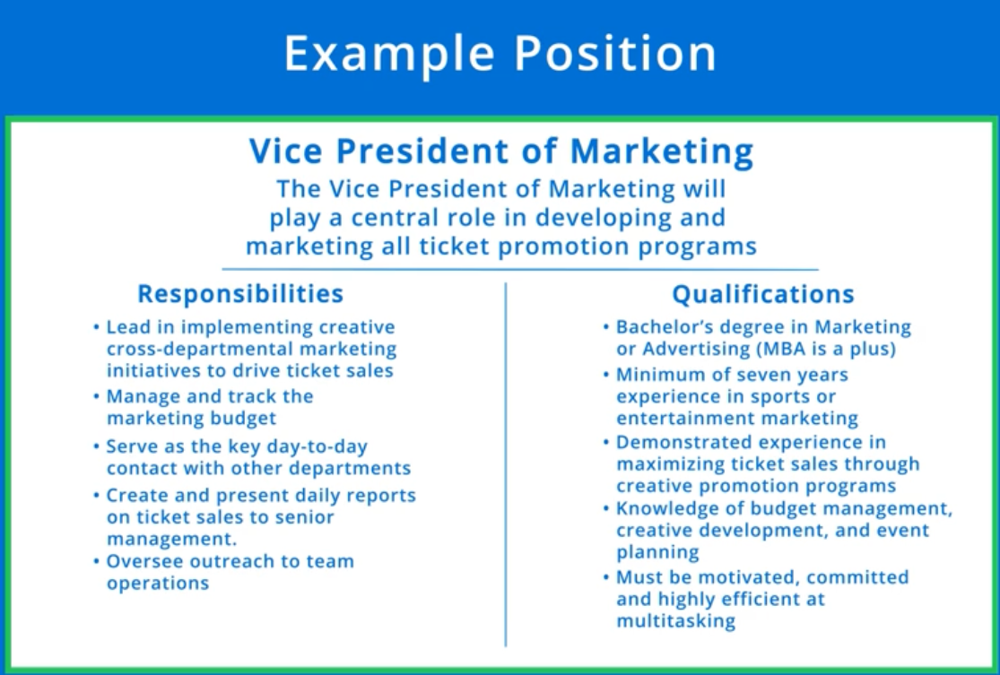

# Analyze the Job Desccription

## Tips

* Customizing your responses will make you stand out.

## Dealing with Jobs Without Detailed Descriptions

1. Work with your network to see if you can find anything more about the position.
2. Search similar job descriptions for similar roles at similar companies.

## Jobs with Detailed Descriptions

* **Identify Competencies:** highlight all qualifications, duties, and desired competencies. Make special note of things mentioned more than once. The most important parts are listed first.
* **Identify Themes:**
* **Identify your selling points:** Talk about awards and skills I can back up.
* **Gaps/Weaknesses**: be prepared to proactively reframe and react when interviewers react to your weaknesses.
* **Anticipate Questions:** Tell me about your one of your successes. Share an example of your leadership skills (prepare stories about leadership). Walk me through your budget management experience. Why did you leave your theater roll if that's really what you want to do? (Maybe he was fired?)

### Example

#### Identify Competencies

* Ticket promotion programs is mentioned very prominently.
* _Lead, Manage, management skills, key day-to-day contact_ suggests you're great at relationship building and communication.
* Prepare to talk about _your fit_.

#### Identify Themes

* _Serve as the key day-to-day contact with other departments:_
* _Manage/track the marketing budget:_ budget management is a specific skill.

#### Identify Your Selling Points

* Do you have more than the required skills?
* Awards
  * I had a recent promotion I can talk about.
* Great communication skills

#### Identifying Gaps

* Even though I have 4 years of coding, it's game development which is related, but not the same.
* I don't have experience with budget management so I need to show I can manage a budget effectively.

#### Anticipate Questions

*
