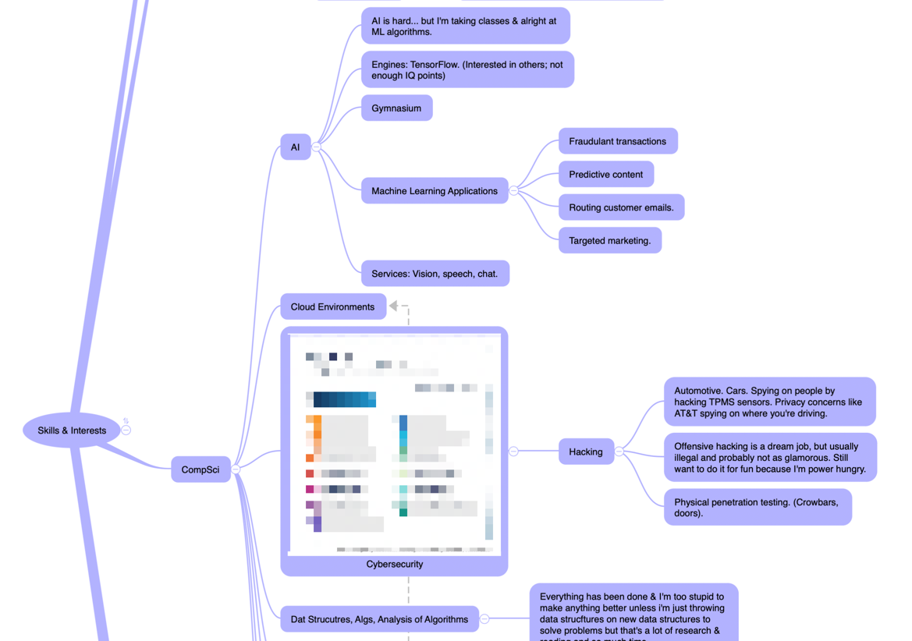

# Generating Ideas
Before I go approaching professors it's probably a respectful to do a little work beforehand.

## How Not to Generate Ideas

* Listing off your skills:
  * Nice review of yourself.
  * But useless because you're gonna go way deeper than anything you knew.
  * E.g. some library in another library somewhere doensn't require my immediate knowledge of C.
* Asking your coworkers about problems you've identified until you're 90% confident maybe you're not being stupid.

## Thesis Notes to Self
1. Consider cross-disciplinary research.
2. Tie it into my career by viewing how gaming tech can be applied to other areas (Education/Training!)
3. DoD MWR Library Databases.
4. Oreilly's Radar Trends are interesting places to start.
5. ARS Tetchnica